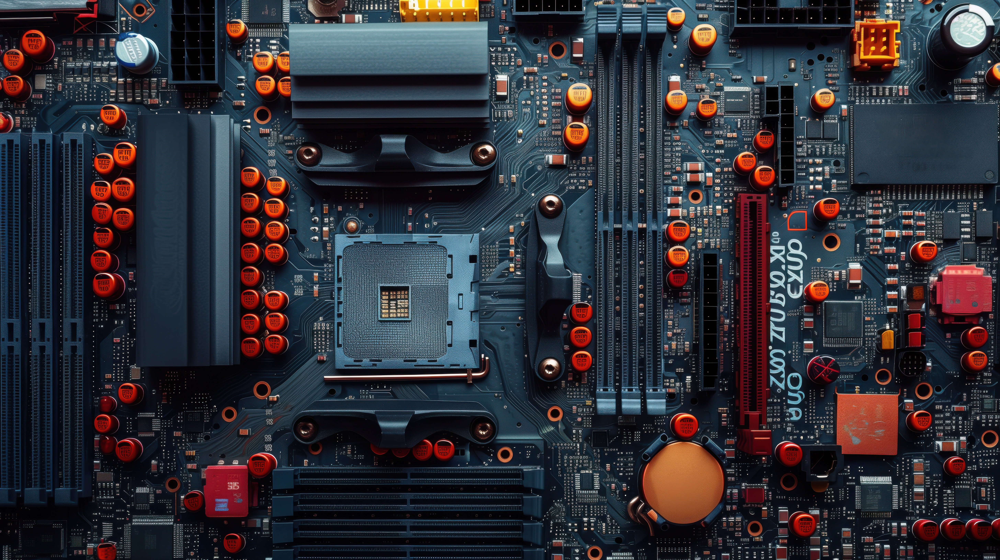

# Computer Hardware Basics

<p align="center">
  
</p>

## Table of Contents

- [Introduction](#introduction)
- [Key Hardware Components](#1-Key-Hardware-Components)
- [Specialized Hardware for AI Development](#2-Specialized-Hardware-for-AI-Development)
- [Building or Choosing a System](#3-Building-or-Choosing-a-System)
- [Hardware Maintenance and Troubleshooting](#4-Hardware-Maintenance-and-Troubleshooting)

### **Introduction**

To become a proficient Full-Stack AI Developer, understanding computer hardware is vital. Hardware knowledge enables you
to make informed decisions about the systems you use for development, training models, and deploying applications. This
tutorial will explore the key hardware components, their functions, and considerations specific to AI development.

---

### **1. Key Hardware Components**

#### **1.1 Central Processing Unit (CPU)**

The CPU is the brain of the computer, responsible for executing instructions and managing processes. Key considerations:

- **Cores:** A core is an individual processing unit within the CPU. Multiple cores allow the CPU to handle multiple
  tasks simultaneously, which is beneficial for multitasking and parallel processing.
- **Threads:** Threads represent the smallest sequence of programmed instructions that a core can handle. Multithreading
  enables better utilization of cores by dividing tasks into smaller threads.
- **Clock Speed:** Measured in GHz, it indicates how many cycles a CPU can perform per second. Higher clock speeds mean
  the CPU can execute instructions more quickly, improving single-threaded task performance.
- **Cache:** The CPU cache is a small amount of high-speed memory located on the CPU chip. It stores frequently accessed
  data and instructions, reducing the need to fetch them from slower main memory.

Popular Choices for AI Development:

- **Intel i7/i9** or **AMD Ryzen 7/9** for general tasks and initial model training.
- Server-grade CPUs like **AMD EPYC** or **Intel Xeon** for larger workloads.

#### **1.2 Graphics Processing Unit (GPU)**

GPUs accelerate parallel computations, making them indispensable for deep learning and other AI applications.

- **CUDA Cores:** Found in NVIDIA GPUs, CUDA cores are specialized processing units for parallel computing. They are
  particularly effective for the large-scale matrix operations required in AI tasks.
- **VRAM:** Video RAM is the GPU's dedicated memory. It temporarily holds data such as textures, models, and other
  information needed for processing. High VRAM (e.g., 8GB or more) is essential for handling large datasets and complex
  models.
- **Tensor Cores:** Specific to NVIDIA GPUs, Tensor Cores enhance the performance of AI-specific tasks like deep
  learning by accelerating mixed-precision matrix multiplications.

Popular GPUs:

- NVIDIA’s **RTX 3090/4090**, **A100**, or **H100**.
- AMD’s **Radeon Instinct** series for an alternative.

#### **1.3 Random Access Memory (RAM)**

RAM is critical for temporarily storing data during computations.

- **Capacity:** Determines how much data can be processed at once. For AI development, 16GB is a good starting point,
  but 32GB or more is preferable for larger datasets.
- **Speed:** Measured in MHz, higher speeds allow data to be accessed more quickly, improving performance in
  memory-intensive tasks.
- **Type:** DDR (Double Data Rate) memory types such as DDR4 and DDR5 differ in speed and energy efficiency, with DDR5
  being the latest and most capable.

#### **1.4 Storage**

Efficient storage solutions are crucial for managing datasets and installed software.

- **Solid-State Drives (SSD):**
    - **NVMe SSDs:** Non-Volatile Memory Express drives offer faster data read/write speeds compared to traditional SATA
      SSDs, significantly reducing loading and transfer times.
    - **Capacity:** AI projects with large datasets typically require at least 1TB of storage.
- **Hard Disk Drives (HDD):** Provide cost-effective, high-capacity storage but are slower than SSDs. Best suited for
  archival purposes.

#### **1.5 Motherboard**

The motherboard connects all components and ensures compatibility.

- **Chipset:** Determines which CPUs, RAM, and expansion options the motherboard supports.
- **Expansion Slots:** Allow for the addition of GPUs, extra RAM, and storage devices.
- **Ports:** USB, HDMI, and Thunderbolt ports facilitate connectivity with peripherals and data transfer.

#### **1.6 Power Supply Unit (PSU)**

The PSU powers all components. AI-focused setups with high-end GPUs demand PSUs with:

- **High Wattage:** Ensures sufficient power supply, especially for systems with multiple GPUs or overclocked
  components.
- **Efficiency Rating:** Rated as 80 PLUS Bronze, Silver, Gold, Platinum, or Titanium. Higher ratings (e.g., Gold or
  Platinum) indicate less energy waste and more reliable performance.

#### **1.7 Cooling System**

AI workloads can strain hardware, generating significant heat. Effective cooling includes:

- **Air Cooling:** Uses fans to dissipate heat from components. Affordable and sufficient for mid-range systems.
- **Liquid Cooling:** Employs liquid to transfer heat away from components. Suitable for high-performance setups under
  heavy workloads.
- **Thermal Paste:** Applied between the CPU/GPU and the cooler to improve heat transfer efficiency.

#### **1.8 Peripherals**

- **Monitors:** High-resolution displays (e.g., 4K) with good color accuracy improve code readability and visualization.
- **Keyboards and Mice:** Ergonomic options enhance productivity and reduce strain during long coding sessions.
- **External Storage:** Portable SSDs or HDDs provide convenient options for backups and data transfer.

---

### **2. Specialized Hardware for AI Development**

#### **2.1 Tensor Processing Units (TPUs)**

Developed by Google, TPUs are specialized hardware designed for machine learning tasks. They excel at performing matrix
computations efficiently, making them suitable for training and inference in deep learning.

#### **2.2 Field-Programmable Gate Arrays (FPGAs)**

FPGAs are customizable hardware components that can be configured for specific tasks. They offer high performance for
niche applications, though they are less common in mainstream AI development.

#### **2.3 Edge Devices**

For AI deployment on devices, consider:

- **NVIDIA Jetson Nano/Xavier:** Compact modules optimized for edge computing with AI capabilities.
- **Raspberry Pi with AI Accelerators:** Affordable devices for prototyping AI applications.

---

### **3. Building or Choosing a System**

#### **3.1 Prebuilt vs. Custom Systems**

- **Prebuilt Systems:** Convenient but may lack flexibility for upgrades.
- **Custom Builds:** Allow tailoring to specific needs but require more technical expertise.

#### **3.2 Cloud Computing**

Cloud platforms like AWS, GCP, and Azure provide access to high-performance hardware for large-scale tasks, avoiding
upfront costs.

#### **3.3 Scalability**

Plan for future upgrades. Choose hardware that allows adding more RAM, GPUs, or storage as your needs grow.

---

### **4. Hardware Maintenance and Troubleshooting**

#### **4.1 Regular Maintenance**

- Clean dust from components to prevent overheating.
- Monitor hardware temperatures with tools like **HWMonitor** or **MSI Afterburner**.

#### **4.2 Troubleshooting Common Issues**

- **Overheating:** Check cooling systems and thermal paste.
- **Hardware Failures:** Use diagnostic tools to identify faulty components.
- **Performance Bottlenecks:** Upgrade bottlenecked parts like RAM or GPUs.

---

### **Conclusion**

A strong understanding of computer hardware empowers Full-Stack AI Developers to optimize their workflows, reduce costs,
and maximize performance. Whether you’re building a system, selecting a cloud provider, or maintaining hardware, this
knowledge lays the foundation for efficient and scalable AI development.

Stay tuned for the next tutorial in this series: **How Computers Process Information**.

```text
I will update this tutorial if I acquire any new information.
```

## Sources

```text
Image by freepik.com
```