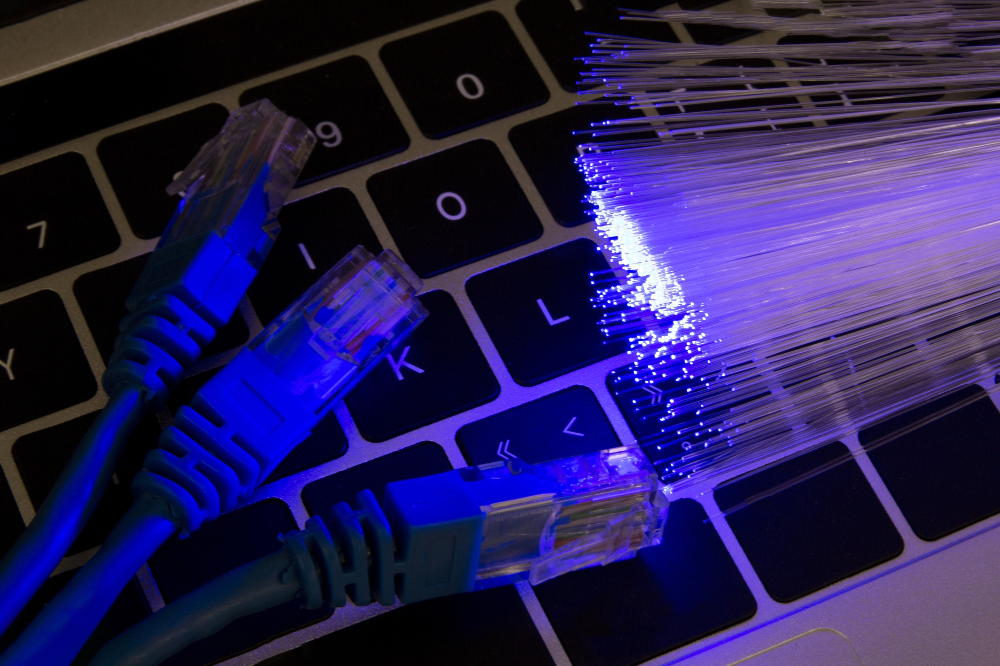

# Networking Basics

<p align="center">
  
</p>

## Table of Contents

- [Introduction](#introduction)
- [What is Networking?](#1-What-is-Networking)
- [Network Types](#2-Network-Types)
- [Network Components](#3-Network-Components)
- [Networking Protocols](#4-Networking-Protocols)
- [OSI Model](#5-osi-model)
- [IP Addressing](#6-ip-addressing)
- [Networking Tools and Utilities](#7-networking-tools-and-utilities)
- [Networking for Full-Stack AI Developers](#8-networking-for-full-stack-ai-developers)
- [Conclusion](#conclusion)

---

### **Introduction**

In our ongoing journey to becoming Full-Stack AI Developers, we’ve already explored the essential building blocks of
computer systems, including how computers process information and the role of operating systems. Now, we’ve reached a
pivotal session: **Networking Basics**. Understanding networking is critical for AI developers, as it underpins
distributed computing, cloud services, API communications, and the flow of data in AI applications. Mastering networking
concepts empowers developers to build scalable, efficient, and connected AI solutions.

In this session, we will delve into the fundamentals of networking, exploring its definition, terminologies, types,
components, and key protocols that form the backbone of modern connectivity.

---

### **1. What is Networking?**

Networking is the process of connecting computers and other devices to share data, resources, and services. It enables
communication between devices within a local environment or across vast distances, making it a cornerstone of modern
technology.

[Connections in a network](Images/connections.jpg)

#### **Key Terminologies**

- **Node:** Any device connected to a network, such as a computer, smartphone, or server.
- **Protocol:** A set of standardized rules governing communication between devices. Examples include HTTP, FTP, and
  TCP/IP.
- **IP Address:** A unique numerical identifier assigned to each device on a network, allowing them to be located and
  communicate with one another.
- **MAC Address:** A unique identifier assigned to a network interface controller (NIC), used for communication within a
  local network.
- **Port:** A logical endpoint for network communications. For example, port 80 is used for HTTP.
- **Packet:** A unit of data transmitted over a network. Packets contain both the data being sent and metadata like
  destination addresses.

---

### **2. Network Types**

Networking can be classified based on the geographical area it covers and its intended use case. Here’s a detailed look:

[LAN vs. WAN](Images/wan-vs-lan.png)

#### **2.1. Local Area Network (LAN)**

- **Definition:** A network confined to a small geographical area, such as an office or home.
- **Features:** High-speed connections, limited number of devices, and easy setup.
- **Applications:** Connecting personal devices, office computers, and printers.
- **Example:** A network connecting computers in a university lab.

#### **2.2. Wide Area Network (WAN)**

- **Definition:** A network spanning large geographical areas, often connecting multiple LANs.
- **Features:** Utilizes public networks or leased lines for connectivity.
- **Applications:** The Internet is the largest example of a WAN.
- **Example:** A corporate network connecting offices in different countries.

#### **2.3. Personal Area Network (PAN)**

- **Definition:** A network used for communication between devices close to a single person.
- **Features:** Typically uses technologies like Bluetooth or infrared.
- **Applications:** Connecting smartphones to wireless headphones.
- **Example:** A smartwatch syncing with a smartphone.

#### **2.4. Metropolitan Area Network (MAN)**

- **Definition:** A network that spans a city or a large campus.
- **Features:** Larger than LAN but smaller than WAN, often uses high-speed fiber optics.
- **Applications:** Connecting buildings within a city for a single organization.
- **Example:** A municipal network providing internet access to public institutions.

---

### **3. Network Components**

A functional network requires various hardware and software components to ensure smooth communication between devices.
Below are the critical components:

[Network components](Images/components.png)

#### **3.1. Switches and Hubs**

- **Switch:** A device that connects devices within a LAN, forwarding data packets to their intended recipient based on
  MAC addresses.
- **Hub:** A simpler device that broadcasts data to all devices in the network, regardless of the intended recipient.
- **Use Case:** Switches are preferred in modern networks for their efficiency and reduced traffic.

#### **3.2. Routers**

- **Function:** Direct data packets between different networks and manage traffic to ensure efficient routing.
- **Capabilities:** Assign IP addresses via DHCP, act as a gateway to the internet, and provide firewall functionality.
- **Use Case:** Connecting a home or office LAN to the Internet.

#### **3.3. Modems**

- **Function:** Convert data between digital signals (used by computers) and analog signals (used by telephone lines).
- **Types:** DSL modems, cable modems, and fiber modems.
- **Use Case:** Enabling internet connectivity in homes and offices.

#### **3.4. Firewalls**

- **Function:** Act as a barrier between trusted internal networks and untrusted external networks, filtering traffic
  based on predefined rules.
- **Types:** Hardware firewalls (dedicated devices) and software firewalls (installed on computers).
- **Use Case:** Protecting sensitive data and preventing unauthorized access.

---

### **4. Networking Protocols**

Protocols define the rules and standards for communication in a network, ensuring interoperability between devices. Here
are the key protocols:

[Protocols](Images/protocols.gif)

#### **4.1. TCP/IP (Transmission Control Protocol/Internet Protocol)**

- **TCP:** Ensures reliable delivery of data by establishing connections, managing retransmissions, and verifying data
  integrity.
- **IP:** Handles addressing and routing of packets across networks.
- **Use Case:** Forming the foundation of internet communications.

#### **4.2. DNS (Domain Name System)**

- **Function:** Translates human-readable domain names (e.g., www.example.com) into IP addresses.
- **Use Case:** Simplifies website access without requiring users to remember IP addresses.

#### **4.3. HTTP/HTTPS**

- **HTTP (Hypertext Transfer Protocol):** Protocol for transferring web pages.
- **HTTPS:** Secure version of HTTP using SSL/TLS encryption.
- **Use Case:** Accessing websites and APIs securely.

#### **4.4. FTP (File Transfer Protocol)**

- **Function:** Transfers files between devices over a network.
- **Security:** Often replaced by SFTP (Secure FTP) for secure file transfers.
- **Use Case:** Uploading files to a web server.

#### **4.5. SSH (Secure Shell)**

- **Function:** Provides secure remote access to devices using encryption.
- **Use Case:** Managing servers, transferring files, and executing commands remotely.

---

### **5. OSI Model**

The OSI (Open Systems Interconnection) model provides a conceptual framework for understanding how different networking
protocols interact across layers to enable communication. It consists of seven layers, each with distinct
responsibilities:

[OSI model](Images/osi-model.jpg)

#### **5.1 Physical Layer**

- **Function:** Manages the physical medium for data transmission, including cables, switches, and wireless signals.
- **Key Elements:** Bitstream, transmission media (e.g., Ethernet cables, fiber optics), and signal types.
- **Relevance:** Ensures reliable hardware setups for server connections and high-speed data transfer.

#### **5.2 Data Link Layer**

- **Function:** Facilitates error detection, correction, and node-to-node data transfer.
- **Key Protocols:** Ethernet, PPP (Point-to-Point Protocol).
- **Relevance:** Crucial for setting up reliable connections in local networks.

#### **5.3 Network Layer**

- **Function:** Handles packet routing and addressing using IP addresses.
- **Key Protocols:** IPv4, IPv6, ICMP (Internet Control Message Protocol).
- **Relevance:** Enables routing of data between different networks, critical for AI systems accessing remote resources.

#### **5.4 Transport Layer**

- **Function:** Ensures reliable data delivery, error recovery, and segmentation.
- **Key Protocols:** TCP (Transmission Control Protocol), UDP (User Datagram Protocol).
- **Relevance:** Provides reliable data flow for API calls and model inference requests.

#### **5.5 Session Layer**

- **Function:** Manages sessions between devices, maintaining connections and synchronization.
- **Key Elements:** Authentication and session restoration.
- **Relevance:** Important for maintaining persistent connections during model training or API interactions.

#### **5.6 Presentation Layer**

- **Function:** Translates data formats for application compatibility, including encryption and compression.
- **Key Elements:** SSL/TLS, data encoding.
- **Relevance:** Ensures secure communication between clients and servers.

#### **5.7 Application Layer**

- **Function:** Interfaces directly with the user’s applications and manages high-level protocols.
- **Key Protocols:** HTTP, FTP, DNS.
- **Relevance:** Enables interaction with web services and APIs critical for AI deployment.

---

### **6. IP Addressing**

IP addressing is the cornerstone of identifying and locating devices within a network. It enables communication and data
transfer across interconnected systems.

#### **6.1 IPv4 vs. IPv6**

- **IPv4:**
    - 32-bit address space (e.g., 192.168.1.1).
    - Limited to ~4.3 billion unique addresses.
    - Still widely used but faces exhaustion issues.
- **IPv6:**
    - 128-bit address space (e.g., 2001:0db8:85a3::8a2e:0370:7334).
    - Provides an almost unlimited address pool.
    - Enhances performance with built-in security features like IPsec.

#### **6.2 Subnetting**

- **Definition:** Dividing a network into smaller sub-networks for efficient resource management.
- **Key Terms:** Subnet mask, CIDR (Classless Inter-Domain Routing).
- **Relevance:** Helps optimize AI deployments by managing IP ranges efficiently for scalable architectures.

#### **6.3 Public vs. Private IP Addresses**

- **Public IPs:** Used for identifying devices accessible over the Internet.
- **Private IPs:** Restricted to internal network communication (e.g., 192.168.x.x).
- **Relevance:** AI servers often require public IPs for external API access while maintaining private IPs for internal
  computations.

---

### **7. Networking Tools and Utilities**

Understanding and using networking tools is vital for diagnosing, optimizing, and managing AI system deployments.

#### **7.1 Ping and Traceroute**

- **Ping:** Tests connectivity between devices by sending ICMP echo requests.
- **Traceroute:** Maps the path data takes to reach its destination, highlighting potential bottlenecks.
- **Relevance:** Useful for debugging network latency issues affecting AI model deployments.

#### **7.2 Netstat**

- **Function:** Displays active connections and network statistics.
- **Relevance:** Helps monitor API connections and diagnose bottlenecks.

#### **7.3 Wireshark**

- **Function:** Captures and analyzes network traffic.
- **Relevance:** Enables detailed debugging of communication issues between servers and clients.

#### **7.4 SSH (Secure Shell)**

- **Function:** Provides encrypted remote access to servers.
- **Relevance:** Critical for managing cloud-based AI models and performing remote system updates.

---

### **8. Networking for Full-Stack AI Developers**

#### **8.1 Importance of Networking Knowledge**

Networking is not just an ancillary skill but a core competency for Full-Stack AI Developers. From deploying AI models
on cloud platforms to setting up secure communication between microservices, a strong foundation in networking ensures
robust, scalable, and efficient AI systems.

#### **8.2 Key Concepts for AI Deployment**

- **Firewall Configuration:**
    - Define inbound and outbound rules to protect sensitive data.
    - Use firewalls to isolate components, like separating the API layer from the inference engine.

- **Load Balancing:**
    - Distribute incoming traffic across multiple servers to ensure high availability.
    - Tools: NGINX, AWS Elastic Load Balancing.

- **DNS Management:**
    - Use custom domain names for APIs and services.
    - Manage DNS records for internal and external traffic routing.

- **Port Management:**
    - Understand port configurations to enable necessary services (e.g., 443 for HTTPS).
    - Avoid exposing unnecessary ports to minimize security risks.

- **VPN and Secure Tunnels:**
    - Use VPNs to connect distributed AI teams securely.
    - Tools like OpenVPN ensure encrypted communication.

- **Cloud Networking:**
    - Master virtual networks, subnets, and peering in platforms like AWS, Azure, or GCP.
    - Optimize data transfer costs by choosing appropriate regions and zones.

- **Data Streaming:**
    - Understand streaming protocols (e.g., WebSocket, Kafka) for real-time AI applications.
    - Optimize bandwidth usage in distributed systems.

#### **8.3 Best Practices**

- Regularly monitor network traffic to identify anomalies.
- Employ automated tools for configuration management and updates.
- Document network setups for reproducibility and troubleshooting.

---

### **Conclusion**

Networking knowledge is essential for deploying scalable and secure AI solutions. By understanding the OSI model,
mastering IP addressing, and leveraging the right tools, Full-Stack AI Developers can build systems that communicate
efficiently and handle real-world challenges with confidence. Whether it’s setting up secure APIs or optimizing data
flow in distributed architectures, networking remains a critical skill on your journey to mastering AI development.

---

## Note

Stay tuned for the next tutorial in this series: **Command-Line Interface (CLI)**.

```text
I will update this tutorial if I acquire any new information.
```

## Sources

```text
Images by:
* freepik.com
* purple.ai
* blog.netwrix.com
* linkedin.com @rocky-bhatia
* infosectrain.com
```