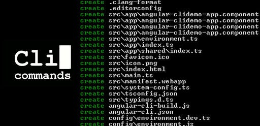

# Command-Line Interface (CLI)

<p align="center">
  
</p>

## Table of Contents

- [Introduction](#introduction)
- [What Is a Command-Line Interface?](#what-is-a-command-line-interface)
- [Why Developers Use the CLI](#why-developers-use-the-cli)
- [Essential CLI Concepts](#essential-cli-concepts)
- [Common Commands](#common-commands)
- [Pipes and Redirection](#pipes-and-redirection)
- [Command History and Aliases](#command-history-and-aliases)
- [Package Managers](#package-managers)
- [CLI Across Platforms](#cli-across-platforms)
- [Scripting Basics](#scripting-basics)
- [Best Practices](#best-practices)

---

## Introduction

The **Command-Line Interface (CLI)** is a text-based interface that allows users to interact with their computer system through commands.  
It is one of the most essential skills for any developer, especially full-stack AI developers working with Linux servers, automation scripts, cloud deployments, or machine-learning pipelines.

This tutorial gives you a practical and conceptual understanding of the CLI—how it works, why it’s crucial, and how to use it effectively.

---

## What Is a Command-Line Interface?

A **Command-Line Interface** is a program that reads text commands and instructs the operating system to perform tasks such as managing files, running programs, installing packages, connecting to servers, and much more.

Examples of CLIs:

- Windows **Command Prompt**
- Windows **PowerShell**
- Linux/macOS **bash**, **zsh**, **fish**

---

## Why Developers Use the CLI

The CLI offers:

- **Speed:** Many tasks require one command instead of many UI clicks.
- **Automation:** Essential for scripting and DevOps.
- **Remote access:** Servers often provide only a text interface.
- **Reproducibility:** Commands can be documented, shared, and version-controlled.
- **Power:** Many advanced features are CLI-only.

---

## Essential CLI Concepts

### Shell

A **shell** is the program that interprets your commands.  
Common shells:

- `bash` — default on many Linux systems
- `zsh` — default on macOS
- `powershell` — powerful object-based shell on Windows

### Terminal

A **terminal** is the application that displays the shell (e.g., Windows Terminal, GNOME Terminal, iTerm2).

### Prompt

The **prompt** is the text you see before entering a command.
Example:

```shell
user@machine:~$
```

### Commands, Flags, and Arguments

- **Command** — action to execute  
- **Argument** — item the command acts on  
- **Flags/Options** — modify behavior of the command  

Example:

```shell
ls -l /home
```

- `ls` → command  
- `-l` → flag  
- `/home` → argument  

### Environment Variables

Environment variables store configuration values accessible to processes.

Common ones:

- `PATH` — list of directories used to locate executables  
- `HOME` — home directory  
- `USER` — username  

Show environment variables:

Linux/macOS:

```bash
printenv
```

Windows PowerShell:

```powershell
Get-ChildItem Env:
```

### Paths and Directories

- **Absolute path:** starts at root  
  - `/home/user/docs`
  - `C:\Users\User\Documents`
- **Relative path:** relative to current directory  
  - `./project`
  - `../`

---

## Common Commands

### Navigation

Linux/macOS:

```bash
pwd       # print working directory
ls        # list files
cd        # change directory
```

Windows:

```powershell
pwd       # print working directory (returns location object)
dir       # list files (alias for Get-ChildItem)
cd        # change directory (alias for Set-Location)
```

### File and Directory Operations

Linux/macOS:

```bash
touch file.txt        # create an empty file or update timestamp
mkdir folder          # create a directory
cp a.txt b.txt        # copy a file
mv a.txt folder/      # move or rename a file
rm a.txt              # remove a file
```

Windows:

```powershell
New-Item file.txt                    # create a new file
New-Item folder -ItemType Directory  # create a directory
Copy-Item a.txt b.txt                # copy a file
Move-Item a.txt folder/              # move or rename a file
Remove-Item a.txt                    # remove a file
```

### Viewing and Searching Content

Linux/macOS:

```bash
cat file.txt               # display file contents
less file.txt              # view file interactively (scrollable)
grep "text" file.txt       # search for text inside a file
```

Windows:

```powershell
Get-Content file.txt             # display file contents
Select-String "text" file.txt    # search for text inside a file
```

### Process Management

Linux/macOS:

```bash
ps aux                 # show all running processes with details
kill <pid>             # terminate a process by PID
top                    # real-time interactive process viewer
htop                   # enhanced interactive process viewer (if installed)
```

Windows:

```powershell
Get-Process                     # list running processes
Stop-Process -Id <pid>          # terminate a process by PID
tasklist                        # show running tasks (Windows command)
taskkill /PID <pid> /F          # forcefully kill a task by PID (Windows command)
```

### System Information

Linux/macOS:

```bash
uname -a      # show detailed system/kernel information
df -h         # display disk usage in human-readable format
free -h       # show memory (RAM) usage in human-readable format
```

Windows:

```powershell
Get-ComputerInfo    # show detailed system information (OS, BIOS, hardware, etc.)
Get-PSDrive         # list drives and their used/available space
                    # (similar to df -h but includes non-filesystem drives as well)
```

### Permissions

Linux/macOS:

```bash
chmod 755 file.txt       # change file permissions (rwxr-xr-x)
chown user:group file.txt # change file owner and group
ls -l                    # list files with permissions and ownership
```

Windows:

```powershell
icacls file.txt /grant User:F    # grant full control to a user
icacls file.txt /remove User     # remove permissions for a user
Get-Acl file.txt                 # view file permissions
```

### Networking

Linux/macOS:

```bash
ping example.com            # check network connectivity
ifconfig / ip addr          # display network interfaces and IPs
netstat -tuln               # show listening ports and connections
curl <http://example.com>     # fetch a URL from the terminal
wget <http://example.com>     # download files from a URL
```

Windows:

```powershell
Test-Connection example.com       # ping a host
Get-NetIPAddress                  # list network interfaces and IPs
netstat -ano                      # show listening ports and connections
Invoke-WebRequest <http://example.com> # fetch a URL
```

### Compression / Archiving

Linux/macOS:

```bash
tar -czvf archive.tar.gz folder/    # create gzip compressed archive
tar -xzvf archive.tar.gz            # extract gzip compressed archive
zip archive.zip file1 file2         # create zip archive
unzip archive.zip                   # extract zip archive
```

Windows:

```powershell
Compress-Archive -Path file1,file2 -DestinationPath archive.zip   # create zip archive
Expand-Archive -Path archive.zip -DestinationPath ./             # extract zip archive
```

### Package Management

Linux/macOS (Debian/Ubuntu example):

```bash
sudo apt update             # update package list
sudo apt upgrade            # upgrade installed packages
sudo apt install package    # install a package
sudo apt remove package     # remove a package
```

Linux/macOS (RedHat/Fedora example):

```bash
sudo dnf update             # update packages
sudo dnf install package    # install a package
sudo dnf remove package     # remove a package
```

Windows (PowerShell / Windows Package Manager):

```powershell
winget search package       # search for a package
winget install package      # install a package
winget uninstall package    # uninstall a package
```

### Disk Usage and Storage Analysis (additional helpful)

Linux/macOS:

```bash
du -h folder/            # show disk usage of a folder
du -sh *                 # summarize disk usage of files/folders
lsblk                    # list block devices and partitions
```

Windows:

```powershell
Get-ChildItem | Measure-Object -Property Length -Sum   # sum size of files in a folder
Get-Volume                                            # list volumes and their free space
```

### PowerShell Script Execution (Windows only)

Windows:

```powershell
Get-ExecutionPolicy                # view current execution policy
Set-ExecutionPolicy RemoteSigned   # allow running local scripts and signed remote scripts
Set-ExecutionPolicy Unrestricted   # allow running all scripts (less secure)
Set-ExecutionPolicy Restricted     # default: blocks all scripts
```

---

## Pipes and Redirection

### Pipes

Pipes (`|`) send output of one command into another.

```bash
ls -l | grep "txt"      # list files in long format, then filter lines containing "txt"
```

### Redirection

Redirect output to a file:

```bash
echo "hello" > file.txt       # write text to file (overwrite)
cat file.txt >> file.txt      # append file contents to itself
```

---

## Command History and Aliases

### History

```bash
history           # Linux/macOS
Get-History       # PowerShell
```

### Aliases

Aliases simplify long commands.
An alias is a short, custom command that stands in for a longer command.

Linux/macOS:

```bash
alias ll="ls -la"         # create an alias 'll' that runs 'ls -la'
```

PowerShell:

```powershell
Set-Alias ll Get-ChildItem    # create an alias 'll' for the Get-ChildItem cmdlet (similar to 'ls')
```

---

## Package Managers

Every OS has its own package manager:

- **Windows**: `winget`, `choco`  
- **Linux**: `apt`, `yum`, `dnf`, `pacman`  
- **macOS**: `brew`  

Example (Ubuntu):

```bash
sudo apt install python3
```

---

## CLI Across Platforms

### Windows

- Command Prompt (old)
- PowerShell (powerful, object-oriented)
- Windows Terminal (modern interface)
- WSL (Windows Subsystem for Linux)

### Linux

- Bash is dominant
- Everything is file-based
- Most servers run Linux

### macOS

- Unix-based
- Uses `zsh` by default
- Strong developer ecosystem

---

## Scripting Basics

You can write scripts to automate tasks.

Bash script:

```bash
#!/bin/bash
echo "Hello from a script"
```

PowerShell script:

```powershell
Write-Host "Hello from PowerShell"
```

---

## Best Practices

- Use clear directory structures  
- Leverage tab completion  
- Use aliases for speed  
- Prefer CLI for automation and repeatability  
- Document your frequently used commands  
- NEVER blindly run commands from untrusted sources  

---

## Note

```text
I will update this tutorial if I acquire any new information.
```

## Sources

```text
Sample
```
