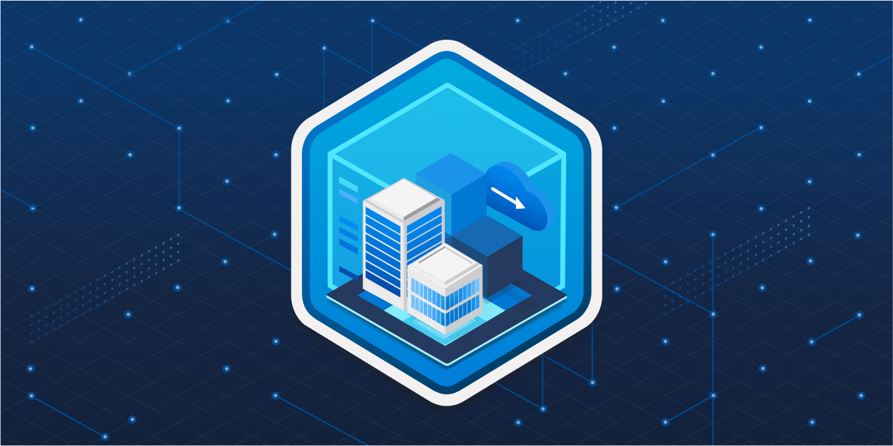
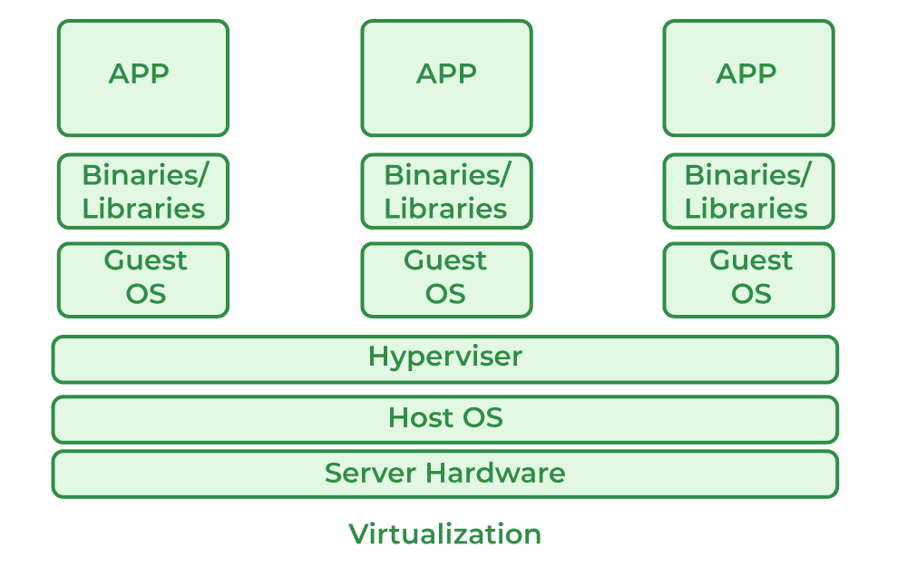
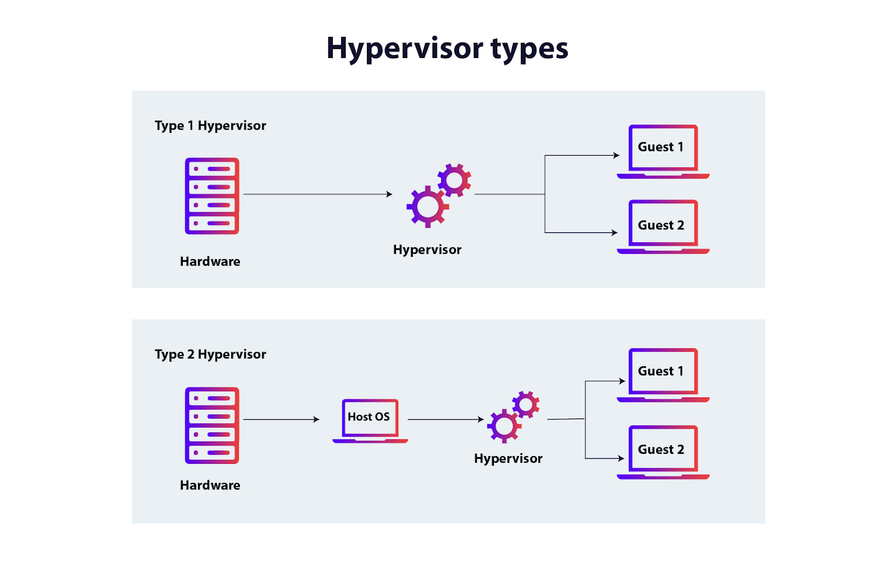
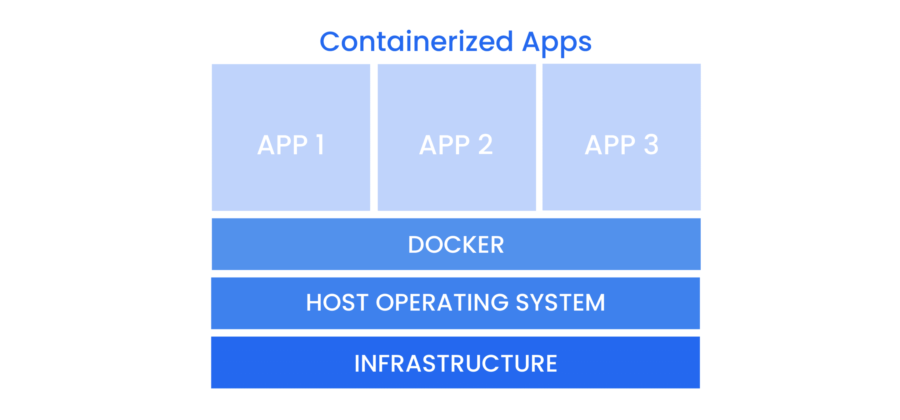
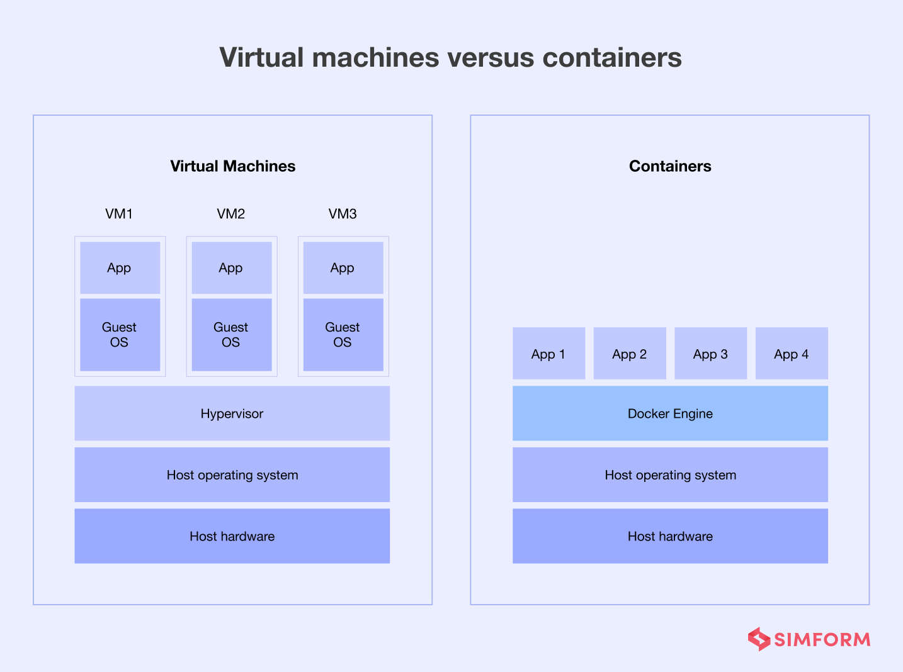
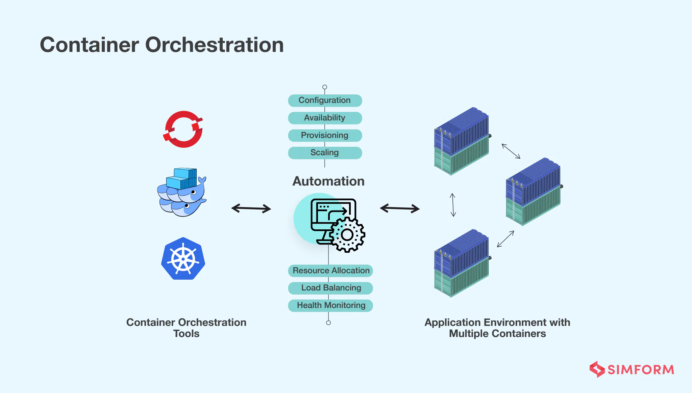

# Virtualization and Containers

<p align="center">
  
</p>

## Table of Contents

- [Introduction](#introduction)
- [What Is Virtualization?](#what-is-virtualization)
- [What Are Containers?](#what-are-containers)
- [Virtual Machines vs Containers](#virtual-machines-vs-containers)
- [Using Virtual Machines](#using-virtual-machines)
- [Using Containers](#using-containers)
- [Container Orchestration](#container-orchestration)
- [Virtualization in Cloud Computing](#virtualization-in-cloud-computing)
- [Best Practices](#best-practices)

---

## Introduction

Virtualization and containers are the foundation of modern software development, deployment, and MLOps.  
Whether you're hosting a database, running machine learning training jobs, or deploying an API in production, these technologies let you isolate environments, scale efficiently, and manage systems reliably.

This tutorial explains virtualization, containers, and their roles in full-stack AI development.

---

## What Is Virtualization?

**Virtualization** is the technology that allows multiple operating systems to run on a single physical machine simultaneously.

A **Virtual Machine (VM)** is a fully isolated operating system running on virtualized hardware.

---

### How Virtual Machines Work

A VM includes:

- Virtual CPU
- Virtual RAM
- Virtual storage
- Virtual network interfaces

The host machine provides these resources through a hypervisor.

Diagram (conceptually):



---

### Hypervisors

A **hypervisor** is the software layer that creates and manages virtual machines.



Two types:

#### Type 1 — Bare-metal hypervisors

Runs directly on hardware.

- VMware ESXi  
- Microsoft Hyper-V  
- Xen  

Used in datacenters and cloud platforms.

#### Type 2 — Hosted hypervisors

Runs on top of a host OS.

- VirtualBox  
- VMware Workstation  
- Parallels  

Used for development and experimentation.

---

### Benefits of Virtualization

- Run multiple OSs on one machine  
- Full system isolation  
- Easy snapshots and backups  
- Ideal for testing environments  
- Foundation of cloud services (AWS EC2, Azure VMs)

---

## What Are Containers?

A **container** packages an application and its dependencies in a lightweight, isolated environment.  
Unlike VMs, containers **share the host OS kernel**.

---

### How Containers Work

A container includes:

- Application code
- Libraries and dependencies
- Minimal filesystem

Containers share:

- Host OS kernel
- Host resources

Conceptual diagram:



---

### Container Runtimes

Popular runtimes:

- `Docker` (most common)
- `containerd` (used by k8s)
- `podman`
- `CRI-O`

Docker is the primary tool developers use.

---

### Benefits of Containers

- Lightweight and fast  
- Consistent environments ("works on my machine" solved)  
- Easy deployment  
- Great for microservices  
- Ideal for ML experiments and reproducibility  
- Cloud-native  

---

## Virtual Machines vs Containers

| Feature | VM | Container |
|--------|----|-----------|
| OS | Full OS | Shared host kernel |
| Boot Time | Slow (seconds-minutes) | Very fast (milliseconds) |
| Resource Usage | Heavy | Lightweight |
| Isolation | Strong | Medium |
| Use Case | Full OS, testing, virtualization | Deploying apps, microservices, ML workflows |



---

## Using Virtual Machines

### Common VM Tools

- **VirtualBox** (free, cross-platform)
- **VMware Workstation / Fusion**
- **Hyper-V** (Windows)
- **Parallels** (macOS)

---

### Creating and Managing VMs

Typical workflow:

1. Install hypervisor  
2. Download ISO (Linux distro, Windows, etc.)  
3. Create VM (set CPU, RAM, disk sizes)  
4. Install OS inside the VM  
5. Take snapshots  
6. Run/stop VM as needed  

Example (VM control using VBoxManage):

```bash
VBoxManage startvm "Ubuntu"
VBoxManage controlvm "Ubuntu" poweroff
```

---

## Using Containers

### Docker Basics

Check Docker version:

```bash
docker --version
```

Run a test container:

```bash
docker run hello-world
```

---

### Docker Images and Containers

Pull an image:

```bash
docker pull ubuntu
```

Run a container:

```bash
docker run -it ubuntu bash
```

List containers:

```bash
docker ps -a
```

Build an image from a Dockerfile:

```bash
docker build -t myapp .
```

Example Dockerfile:

```dockerfile
FROM python:3.10
WORKDIR /app
COPY . .
RUN pip install -r requirements.txt
CMD ["python", "main.py"]
```

---

### Volumes and Networking

#### Volumes (persistent storage)

```bash
docker run -v mydata:/data ubuntu
```

#### Networking

```bash
docker run -p 8080:80 nginx
```

---

### Docker Compose

Compose lets you manage multi-container applications.

Example `docker-compose.yml`:

```yaml
version: "3"
services:
  backend:
    build: .
    ports:
      - "8000:8000"
  redis:
    image: redis:latest
```

Run:

```bash
docker compose up
```

---

## Container Orchestration

## What is Container Orchestration?

Container orchestration is the process of automating the deployment, management, scaling, and networking of containers.
With Docker, you can run one container easily on a single machine. But in real-world applications, you often have dozens, hundreds, or even thousands of containers running across multiple machines (servers). Managing all of these manually would be a nightmare. You’d need to handle:

- Starting/stopping containers
- Ensuring the right number of containers are running (scaling)
- Load balancing traffic between containers
- Updating containers without downtime
- Recovering containers if they crash

This is exactly what container orchestration tools do automatically.

It handles:

- Scaling containers  
- Load balancing  
- Self-healing  
- Deployments and rollouts  
- Networking  

You can deploy ML APIs, workers, vector databases, and pipelines with Kubernetes.

Why Orchestration Matters

- Production-grade scaling  
- Zero-downtime deployments  
- Efficient resource scheduling  
- Multi-node cluster management  

Essential for MLOps and cloud-based AI services.



### Kubernetes

Kubernetes (k8s) is the industry-standard orchestration system. Kubernetes manages the lifecycle of containers across a cluster of machines.

Key Features of Kubernetes:

- Automated Scheduling – Decides which container goes on which server.
- Scaling – Automatically increases or decreases the number of containers based on load.
- Self-Healing – Restarts containers that fail or reschedules them if a node dies.
- Load Balancing & Service Discovery – Routes traffic to containers reliably.
- Rolling Updates & Rollbacks – Updates applications without downtime and can revert if needed.
- Secret & Configuration Management – Securely stores sensitive info and config.

Kubernetes Components (Simplified):

- Node: A machine (VM or physical) in the cluster.
- Pod: Smallest unit in Kubernetes; usually one or more containers.
- Cluster: Group of nodes managed together.
- Deployment: Defines how many replicas of a container should run.
- Service: Exposes pods to the network and handles load balancing.

In short: Kubernetes is like Docker Compose on steroids for production-level, distributed, highly available applications.

---

## Virtualization in Cloud Computing

Cloud providers use virtualization to offer services like:

- EC2 (AWS)
- Compute Engine (GCP)
- VM Instances (Azure)

They also use containers for serverless and orchestration:

- AWS ECS / EKS  
- Azure AKS  
- GCP GKE  

Your ML pipelines will use both VMs and containers depending on the workload.

---

## Best Practices

- Use VMs for full OS isolation and experimentation  
- Use containers for deployment and reproducibility  
- Keep images lightweight (avoid unnecessary packages)  
- Always pin versions in Dockerfiles  
- Use `.dockerignore` to reduce image size  
- Tag images properly (`myapp:1.0`)  
- Prefer Compose for local development  
- Prefer Kubernetes for production  

---

## Note

```text
I will update this tutorial if I acquire any new information.
```

## Sources

```text
Sample
```
