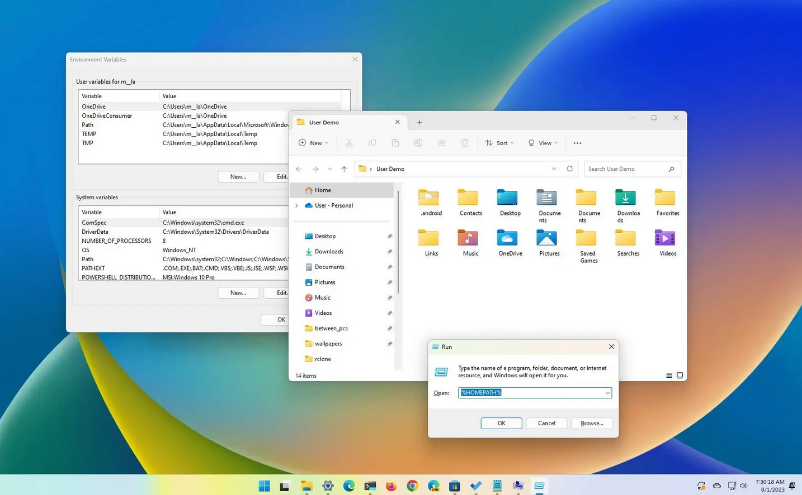

# Environment Variables

<p align="center">
  
</p>

## Table of Contents

- [Introduction](#introduction)
- [What Are Environment Variables?](#what-are-environment-variables)
- [Why Environment Variables Are Important](#why-environment-variables-are-important)
- [Accessing Environment Variables](#accessing-environment-variables)
- [Setting Environment Variables](#setting-environment-variables)
- [Common Environment Variables](#common-environment-variables)
- [Use Cases in Development](#use-cases-in-development)
- [Best Practices](#best-practices)

---

## Introduction

**Environment Variables** are key-value pairs that store configuration information used by the operating system and applications.  
They allow programs to adapt to different environments without changing the source code.  

In this tutorial, you will learn what environment variables are, why they are important, how to access and set them, and how to use them effectively in development workflows.

---

## What Are Environment Variables?

An **environment variable** is a dynamic value that can affect the behavior of processes on a computer.  
They can be system-wide or user-specific and often include paths, configuration settings, credentials, or flags.

Example:

```text
PATH=/usr/local/bin:/usr/bin:/bin
HOME=/home/user
```

---

## Why Environment Variables Are Important

- **Configuration management:** Keep environment-specific settings outside code.  
- **Security:** Store sensitive information (API keys, passwords) safely.  
- **Portability:** Code can run on multiple systems without modification.  
- **Automation:** Scripts and CI/CD pipelines often rely on environment variables.

---

## Accessing Environment Variables

### Linux/macOS

List all variables:

```bash
printenv
env
```

Access a specific variable:

```bash
echo $HOME
echo $PATH
```

### Windows

PowerShell:

```powershell
Get-ChildItem Env:
$Env:HOME
$Env:PATH
```

Command Prompt:

```cmd
echo %HOME%
echo %PATH%
```

### Python

Access environment variables programmatically:

```python
import os

home_dir = os.getenv("HOME")
path = os.getenv("PATH")

print("Home Directory:", home_dir)
print("PATH:", path)
```

Set variables temporarily:

```python
os.environ["MY_VAR"] = "123"
print(os.environ["MY_VAR"])
```

---

## Setting Environment Variables

### Temporary Variables

Last only for the current session.

Linux/macOS:

```bash
export MY_VAR="123"
echo $MY_VAR
```

Windows PowerShell:

```powershell
$Env:MY_VAR="123"
echo $Env:MY_VAR
```

Windows Command Prompt:

```cmd
set MY_VAR=123
echo %MY_VAR%
```

### Permanent Variables

Persist across sessions.

Linux/macOS (bash example):

- Add to `~/.bashrc` or `~/.zshrc`:

```bash
export MY_VAR="123"
```

Then reload:

```bash
source ~/.bashrc
```

Windows:

- System Properties → Environment Variables → New / Edit
- Or PowerShell:

```powershell
[Environment]::SetEnvironmentVariable("MY_VAR", "123", "User")
```

---

## Common Environment Variables

| Variable | Description |
|----------|-------------|
| `PATH` | Directories where the system looks for executables |
| `HOME` / `USERPROFILE` | User's home directory |
| `USER` / `USERNAME` | Current username |
| `SHELL` | Current shell program (Linux/macOS) |
| `TEMP` / `TMP` | Temporary file storage |
| `PYTHONPATH` | Additional directories for Python modules |

---

## Use Cases in Development

1. **API Keys and Secrets**  

```bash
export OPENAI_API_KEY="your_key_here"
```

Python usage:

```python
import os
api_key = os.getenv("OPENAI_API_KEY")
```

2. **Configuration Settings**  

- Switching databases (`DEV_DB`, `PROD_DB`)  
- Changing ports (`PORT=8000`)  
- Selecting environments (`ENV=development`)

3. **CI/CD Pipelines**  

- Use environment variables for deployment credentials and build parameters.

---

## Best Practices

- Never hard-code secrets in source code.  
- Use descriptive variable names (`DB_HOST`, `API_KEY`).  
- Keep sensitive keys in `.env` files (use libraries like `python-dotenv`).  
- Separate development, staging, and production variables.  
- Document all required environment variables in project README.

Example `.env` file:

```text
DB_HOST=localhost
DB_USER=admin
DB_PASS=secret
PORT=8000
```

Load in Python with `python-dotenv`:

```python
from dotenv import load_dotenv
import os

load_dotenv()
db_host = os.getenv("DB_HOST")
```

---

## Note

```text
I will update this tutorial if I acquire any new information.
```

## Sources

```text
Sample
```
