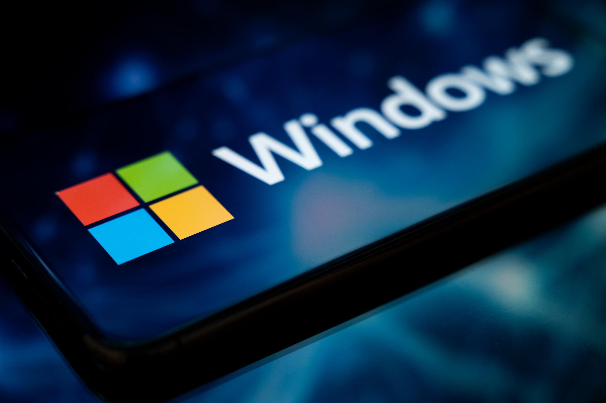

# Windows Basics for AI Developers

<p align="center">
  
</p>

## Table of Contents

- [Introduction](#introduction)
- [Package Managers](#package-managers)
  - [Winget](#winget)
  - [Chocolatey](#chocolatey)
- [GPU Setup for AI](#gpu-setup-for-ai)
  - [Installing NVIDIA Drivers](#installing-nvidia-drivers)
  - [Installing CUDA Toolkit and cuDNN](#installing-cuda-toolkit-and-cudnn)
  - [Verifying GPU Access](#verifying-gpu-access)
  - [Configuring Environment Variables](#configuring-environment-variables)
- [Environment Variables on Windows](#environment-variables-on-windows)
  - [Temporary Variables](#temporary-variables)
  - [Permanent Variables](#permanent-variables)
- [File System and Permissions Notes](#file-system-and-permissions-notes)
- [Best Practices](#best-practices)

---

## Introduction

Windows is still a common development environment for AI developers, especially for local experimentation, GPU workloads, and testing.  
While most production environments use Linux, understanding Windows-specific tools and workflows is essential for a full-stack AI developer.

This tutorial focuses on **practical Windows concepts for AI development**: package managers, GPU setup, environment variables, and file system nuances.

---

## Package Managers

Package managers simplify the installation and updating of software. They are especially useful for managing Python, Git, Docker, VS Code, and other development tools.

### Winget

**Winget** is the official Windows package manager provided by Microsoft.

Install a package:

```powershell
winget install --id Python.Python.3.10
winget install --id Git.Git
winget install --id Microsoft.VisualStudioCode
```

Update packages:

```powershell
winget upgrade --all
```

List installed packages:

```powershell
winget list
```

### Chocolatey

**Chocolatey** is a popular third-party Windows package manager.

Install Chocolatey (PowerShell, run as Administrator):

```powershell
Set-ExecutionPolicy Bypass -Scope Process -Force; `
[System.Net.ServicePointManager]::SecurityProtocol = [System.Net.ServicePointManager]::SecurityProtocol -bor 3072; `
iex ((New-Object System.Net.WebClient).DownloadString('https://community.chocolatey.org/install.ps1'))
```

Install packages:

```powershell
choco install python
choco install git
choco install vscode
```

Update packages:

```powershell
choco upgrade all
```

---

## GPU Setup for AI

### Installing NVIDIA Drivers

1. Visit the [NVIDIA Driver Downloads](https://www.nvidia.com/Download/index.aspx) page.  
2. Select your GPU model and download the latest driver.  
3. Install and reboot your system.

### Installing CUDA Toolkit and cuDNN

1. Download CUDA Toolkit from [NVIDIA CUDA](https://developer.nvidia.com/cuda-downloads).  
2. Install the toolkit (default paths recommended).  
3. Download cuDNN from [NVIDIA cuDNN](https://developer.nvidia.com/cudnn) and copy the files to the CUDA installation directory.

### Verifying GPU Access

Test with **PyTorch**:

```python
import torch
print(torch.cuda.is_available())
print(torch.cuda.get_device_name(0))
```

Test with **TensorFlow**:

```python
import tensorflow as tf
print(tf.config.list_physical_devices('GPU'))
```

### Configuring Environment Variables

- Add CUDA paths to `PATH`:

```powershell
setx PATH "$Env:PATH;C:\Program Files\NVIDIA GPU Computing Toolkit\CUDA\v12.0\bin"
setx PATH "$Env:PATH;C:\Program Files\NVIDIA GPU Computing Toolkit\CUDA\v12.0\libnvvp"
```

- Optional: Set `CUDA_HOME`:

```powershell
setx CUDA_HOME "C:\Program Files\NVIDIA GPU Computing Toolkit\CUDA\v12.0"
```

**IMPORTANT NOTE:**

The versions of CUDA, cuDNN, Python, GPU Driver, TensorFlow, and PyTorch must be compatible with each other. Check the related documentations in TensorFlow or PyTorch before create the environment with a specific Python version, downloading and installing CUDA, and downloading and installing cuDNN.

---

## Environment Variables on Windows

### Temporary Variables

Temporary variables exist only for the current session.

PowerShell:

```powershell
$Env:MY_VAR = "123"
echo $Env:MY_VAR
```

Command Prompt:

```cmd
set MY_VAR=123
echo %MY_VAR%
```

### Permanent Variables

Persist across sessions via GUI or PowerShell.

**GUI Method:**

- Search "Environment Variables" → System Properties → Environment Variables → New / Edit

**PowerShell Method:**

```powershell
[Environment]::SetEnvironmentVariable("MY_VAR", "123", "User")
```

---

## File System and Permissions Notes

- Windows uses backslashes for paths: `C:\Users\User\Documents`.  
- Avoid spaces in paths when scripting, or quote them: `"C:\My Projects\data"`.  
- Line endings differ (`CRLF` vs `LF`) — use tools like Git autocrlf or editors like VS Code.  
- Admin rights may be required for package installations or GPU drivers.  
- Read-only and permissions settings can affect scripts or Docker mounting.

---

## Best Practices

- Prefer package managers (`winget`, `choco`) for reproducibility.  
- Keep CUDA, cuDNN, and drivers up-to-date for AI workloads.  
- Always verify GPU availability after installation.  
- Use environment variables for configuration instead of hard-coding paths.  
- Maintain consistent path conventions for cross-platform projects.  
- Document system-specific instructions in project README.

---

## Note

```text
I will update this tutorial if I acquire any new information.
```

## Sources

```text
Sample
```
