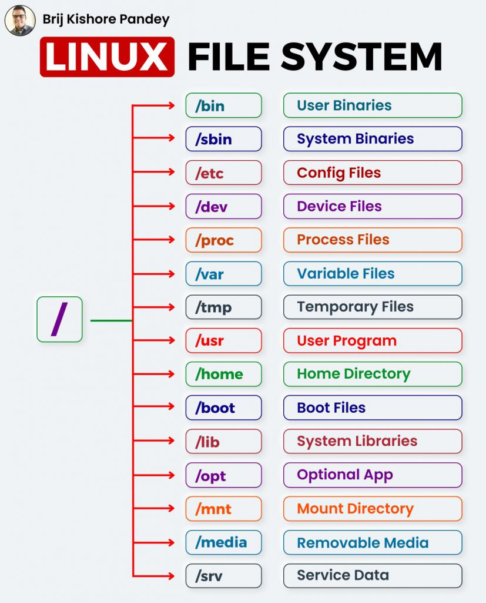

# File System & Permissions

<p align="center">
  
</p>

## Table of Contents

- [Introduction](#introduction)
- [Linux File System Overview](#linux-file-system-overview)
- [File Types in Linux](#file-types-in-linux)
- [Permissions](#permissions)
- [Managing Permissions](#managing-permissions)
- [Users and Groups](#users-and-groups)
- [Symbolic and Hard Links](#symbolic-and-hard-links)
- [Mounting and Drives](#mounting-and-drives)
- [Best Practices](#best-practices)

---

## Introduction

Linux is a multi-user operating system with a hierarchical file system.  
Managing **files, directories, permissions, and users** is fundamental for both system administration and AI development workflows.  
Proper understanding ensures secure, organized, and efficient project environments.

---

## Linux File System Overview

### Directory Structure

Linux uses a **single-rooted directory tree**, with all directories branching from `/`.



| Directory | Purpose |
|-----------|---------|
| `/`       | Root directory |
| `/home`   | User home directories |
| `/etc`    | System configuration files |
| `/var`    | Variable data like logs, databases |
| `/usr`    | Installed software and libraries |
| `/bin`    | Essential binaries for users |
| `/sbin`   | System binaries for root |
| `/tmp`    | Temporary files |
| `/dev`    | Device files |
| `/proc`   | Process and kernel info |

> Understanding these directories is crucial when installing software, setting environment variables, and deploying AI projects.

### Absolute vs Relative Paths

- **Absolute Path:** Starts from root (`/`)  
  - Example: `/home/devuser/projects`  
- **Relative Path:** Relative to current directory  
  - Example: `./myproject` or `../otherfolder`

### Hidden Files and Dotfiles

- Files starting with `.` are hidden (e.g., `.bashrc`, `.gitconfig`)  
- Used for user and application configuration  
- List all files including hidden:

```bash
ls -a
```

---

## File Types in Linux

Linux files can be one of several types:

- **Regular files:** Text, scripts, binaries  
- **Directories:** Contain files and subdirectories  
- **Symbolic links:** Pointers to other files  
- **Device files:** Represent hardware (`/dev/sda`)  
- **Sockets and pipes:** For inter-process communication

Check file type with:

```bash
ls -l
file filename
```

---

## Permissions

### Understanding Read, Write, Execute

- **Read (r):** View file content or list directory  
- **Write (w):** Modify file content or create/delete files in a directory  
- **Execute (x):** Run a file as a program or access directory contents

### Owner, Group, Others

Permissions are assigned to three categories:

| Category | Definition |
|----------|------------|
| Owner (u)   | The user who owns the file |
| Group (g)   | Users in the file’s group |
| Others (o)  | All other users |

Example permissions:

```text
-rwxr-xr--
```

- `rwx` → owner can read, write, execute  
- `r-x` → group can read and execute  
- `r--` → others can read only

### Special Permissions (SUID, SGID, Sticky Bit)

- **SUID (Set User ID):** Execute file with owner’s permissions  
- **SGID (Set Group ID):** Execute file with group’s permissions  
- **Sticky Bit:** Only file owner can delete files in a directory (e.g., `/tmp`)

---

## Managing Permissions

### chmod

Change file/directory permissions.

Symbolic mode:

```bash
chmod u+x script.sh       # Add execute for owner
chmod g-w file.txt        # Remove write from group
chmod o+r file.txt        # Add read for others
```

Numeric mode:

```bash
chmod 755 script.sh       # rwx for owner, r-x for group/others
chmod 644 file.txt        # rw for owner, r for group/others
```

### chown

Change file owner:

```bash
sudo chown username file.txt
sudo chown username:groupname file.txt
```

### chgrp

Change file group:

```bash
sudo chgrp groupname file.txt
```

---

## Users and Groups

### Creating and Managing Users

- Add user: `sudo adduser devuser`  
- Delete user: `sudo deluser devuser`  
- Change password: `passwd username`  

### Groups and Group Membership

- Add group: `sudo groupadd devgroup`  
- Add user to group: `sudo usermod -aG devgroup devuser`  
- List groups for a user: `groups devuser`

### Sudo Privileges

- Add user to sudo group:

```bash
sudo usermod -aG sudo devuser   # Debian/Ubuntu
```

- Use `sudo` to run commands with root privileges

---

## Symbolic and Hard Links

- **Hard link:** Another name for the same file inode  
  - `ln file1 file2`  
- **Symbolic link (symlink):** Pointer to another file  
  - `ln -s /path/to/file linkname`  
- Useful for organizing directories and managing shared resources

---

## Mounting and Drives

- List disks and partitions: `lsblk`, `df -h`  
- Mount a drive:

```bash
sudo mount /dev/sdb1 /mnt
```

- Unmount a drive:

```bash
sudo umount /mnt
```

- Persistent mounting via `/etc/fstab`

---

## Best Practices

- Keep proper permissions for files and directories (avoid `777`)  
- Use groups to manage team access to projects  
- Regularly check disk usage and mount points  
- Use symbolic links to simplify project structure  
- Document user and group setups for reproducibility

---

## Note

```text
I will update this tutorial if I acquire any new information.
```

## Sources

```text
Sample
```
