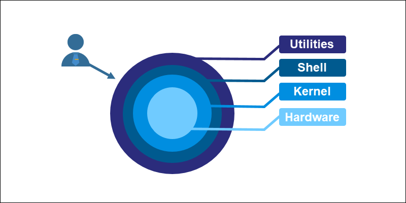
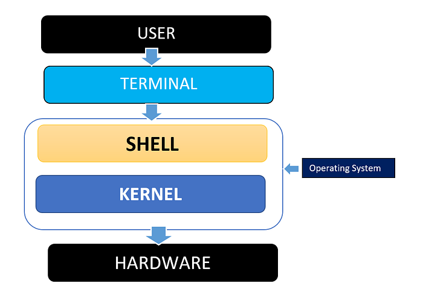

# Command-Line & Shell Essentials

<p align="center">
  
</p>

## Table of Contents

- [Introduction](#introduction)
- [Shell vs Terminal](#shell-vs-terminal)
- [Popular Shells](#popular-shells)
- [Basic Commands](#basic-commands)
- [Redirection and Pipes](#redirection-and-pipes)
- [Aliases and Customization](#aliases-and-customization)
- [Scripting Basics](#scripting-basics)
- [Best Practices](#best-practices)

---

## Introduction

The Linux command line is **the most powerful tool** for a full-stack AI developer.  
From file management to automating workflows, mastering the shell allows you to efficiently work on local machines, remote servers, and cloud environments.  
This tutorial introduces terminal and shell concepts, essential commands, redirection, pipes, and shell customization.

---

## Shell vs Terminal

### What is a Terminal?

A **terminal** is a program that provides a text-based interface to interact with the computer.  
Examples: GNOME Terminal, Konsole, Windows Terminal, iTerm2 (macOS)

### What is a Shell?

A **shell** is the command-line interpreter that processes commands typed in the terminal.  
It provides scripting capabilities, variables, and environment management.  
Common shells: `bash`, `zsh`, `fish`



---

## Popular Shells

### Bash (Bourne Again Shell)

- Default shell on most Linux distributions  
- Powerful scripting capabilities  
- Widely supported for automation and DevOps tasks

### Zsh

- Extended features: better autocomplete, themes (with Oh-My-Zsh)  
- Preferred by developers seeking productivity and customization

### Fish

- User-friendly and interactive shell  
- Modern syntax, autosuggestions, color coding

> As a full-stack AI developer, **Bash or Zsh** is recommended for compatibility and scripting.

---

## Basic Commands

### Navigation

- `pwd` — print working directory  
- `cd <directory>` — change directory  
- `ls` — list directory contents  
- `ls -la` — list including hidden files  
- `tree` — hierarchical view (install with `sudo apt install tree`)

### File and Directory Operations

- Create directories: `mkdir <name>`  
- Remove directories: `rmdir <name>` (empty) or `rm -r <name>` (recursive)  
- Copy files: `cp <source> <destination>`  
- Move/rename files: `mv <source> <destination>`  
- Remove files: `rm <file>`  

### File Inspection

- `cat <file>` — view entire file  
- `less <file>` — paginated view  
- `head <file>` — first lines  
- `tail <file>` — last lines  
- `file <file>` — file type information

### Searching

- `grep "pattern" <file>` — search for text in files  
- `find <path> -name "<pattern>"` — search for files  
- `locate <file>` — quickly find files (requires `updatedb`)

### Command History

- `history` — list previous commands  
- Use **up/down arrows** to navigate previous commands  
- `!!` — repeat last command  
- `!n` — execute command number `n` from history

---

## Redirection and Pipes

- Redirect output to a file:

```bash
echo "Hello World" > output.txt   # overwrite
echo "More text" >> output.txt    # append
```

- Redirect input from a file:

```bash
sort < unsorted.txt
```

- Combine commands with pipes:

```bash
cat file.txt | grep "pattern" | sort
```

- Redirect errors:

```bash
command 2> error.log   # stderr to file
command &> output.log  # stdout and stderr to file
```

---

## Aliases and Customization

- **Aliases** simplify repetitive commands:

```bash
alias ll="ls -la"
alias gs="git status"
```

- Persist aliases in `.bashrc` or `.zshrc`:

```bash
echo 'alias ll="ls -la"' >> ~/.bashrc
source ~/.bashrc
```

- Customize prompt, colors, and environment variables for productivity

---

## Scripting Basics

- Create a script file:

```bash
#!/bin/bash
echo "Hello, AI Developer"
```

- Make it executable:

```bash
chmod +x script.sh
./script.sh
```

- Variables:

```bash
name="Full Stack AI"
echo "Welcome, $name"
```

- Loops:

```bash
for i in {1..5}; do
    echo "Iteration $i"
done
```

- Conditionals:

```bash
if [ -f "file.txt" ]; then
    echo "File exists"
else
    echo "File not found"
fi
```

- Functions:

```bash
greet() {
    echo "Hello $1"
}
greet "Developer"
```

> Shell scripting is essential for automating training pipelines, data processing, deployments, and system administration.

---

## Best Practices

- Use meaningful aliases and functions to simplify workflows  
- Keep scripts modular and version-controlled  
- Comment scripts for readability and future reference  
- Test scripts in a safe environment before running on production  
- Use tab completion and command history to improve productivity  

---

## Note

```text
I will update this tutorial if I acquire any new information.
```

## Sources

```text
Sample
```
