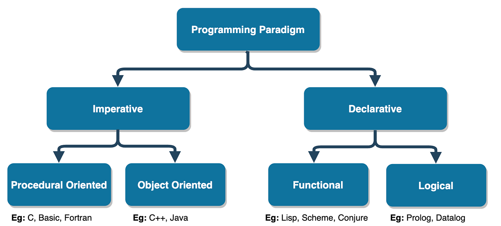

# Basic Concepts

<p align="center">
  
</p>

## Table of Contents

- [Introduction](#introduction)
- [What Is Programming?](#what-is-programming)
- [Programming Paradigms](#programming-paradigms)
- [Compilers, Interpreters & Runtimes](#compilers-interpreters--runtimes)
- [Variables, Data Types & Memory](#variables-data-types--memory)
- [Control Flow](#control-flow)
- [Input/Output & Standard Streams](#inputoutput--standard-streams)
- [Error Handling](#error-handling)
- [Basic Data Structures](#basic-data-structures)
- [Algorithms & Big-O Notation](#algorithms--big-o-notation)
- [Development Workflow Fundamentals](#development-workflow-fundamentals)
- [Libraries, Frameworks & Dependencies](#libraries-frameworks--dependencies)
- [Conclusion](#conclusion)

---

## Introduction

This tutorial collects the essential ideas that every programmer must understand before diving into specific languages (Python, C++, Go, JavaScript, SQL, etc.). It explains how programs are constructed, how they run on machines, and the mental models you should use when designing and debugging software. The goal is clarity and completeness so you won't miss important concepts later.

---

## What Is Programming?

Programming is expressing a sequence of steps (an algorithm) in a language that a computer can execute. A program is a set of these instructions. Humans write source code in a high-level language that is readable by people; that source is then transformed into forms the machine can execute (compiled machine code, bytecode, or interpreted instructions).

Key points:

- Computers execute **machine code** (binary), but humans prefer to write **source code** (Python, C++, JavaScript, Go, etc.).
- The process that transforms source code into something the CPU executes is handled by **compilers**, **interpreters**, and **runtimes** (explained later).
- Programs typically follow a lifecycle: write → transform/compile → run → produce output / side effects.

Analogy: writing a recipe (source) vs. a chef following it (CPU). The compiler/interpreter is the translator between recipe and chef.

---

## Programming Paradigms

A programming paradigm is a style or approach to structuring programs. Languages often support multiple paradigms.

- Imperative: describe *how* to do tasks (step-by-step). Most common general-purpose languages (C, Python) are imperative-friendly.
- Declarative: describe *what* you want without spelling out the steps (e.g., SQL, functional query languages, configuration files).
- Procedural: organize code into procedures or functions—procedural programming is a substyle of imperative programming.
- Object-Oriented (OOP): models data + behavior as objects and classes (encapsulation, inheritance, polymorphism). Common in Java, C++, Python.
- Functional: focuses on pure functions (no side effects), immutability, higher-order functions. Examples: Haskell, but functional styles are common in JS/Python.
- Event-driven: program reacts to events (common in GUI, web backends).



Why paradigms matter: they shape how you think about problems. For example, thinking functionally helps reason about concurrency; OOP helps model entities and behaviors.

---

## Compilers, Interpreters & Runtimes

This section is crucial — it explains how different languages execute and why some are faster or behave differently.

**Compiler**

A compiler is like a translator that converts your entire program into a standalone file the computer can run directly. It does all its work up front before the program ever starts.

- Translates whole source code into machine code (or some low-level binary) before running.
- Produces an executable binary you can run later.
- Typical compiled languages: C, C++, Go, Rust.
- Benefits: usually fast runtime performance, optimizations at compile time.
- Tradeoffs: compile step adds friction; builds can take time.

**Interpreter**

An interpreter runs your code as it reads it, almost like following instructions one step at a time. It doesn’t produce a separate executable file in advance.

- Reads source code and executes it directly, often line-by-line or statement-by-statement.
- Typical interpreted languages: older implementations of Python, Ruby. (Modern implementations may blur lines.)
- Benefits: fast edit-run-debug cycle, interactive shells (REPL).
- Tradeoffs: often slower than compiled binaries.

**Hybrid / Bytecode + VM**

Some languages take a middle path: they compile your code into a simpler form and then use a virtual machine to run it. This keeps things portable and flexible.

- Many languages compile to an intermediate **bytecode**, which is then run on a virtual machine (VM) or interpreted.
- Example: Java compiles to JVM bytecode; .NET compiles to IL; Python compiles to `.pyc` bytecode (which CPython interprets).
- Benefit: portability (run bytecode across platforms), some runtime optimizations.

**JIT (Just-In-Time) Compilation**

A JIT system watches your program as it runs and compiles the parts you use most, giving you speed without needing a full compile step beforehand.

- The runtime compiles frequently-executed parts of code into machine code on the fly (hot paths), combining ease-of-use with performance.
- Examples: Java HotSpot, V8 (Node.js / Chrome), PyPy.
- Benefit: good runtime performance; drawback: runtime overhead and complexity.

**Runtime**

A runtime is the environment that makes your program actually work, providing the tools and services it needs while it’s running.

- The runtime supplies support services for executing programs: memory allocation, I/O, garbage collection (if any), standard libraries.
- Examples: Python runtime, JVM, Node.js environment.

**Classification summary**

- Compiled ahead-of-time (AOT): C, C++, Go — produce native executables.
- Interpreted: (traditional) Python, Ruby — read/execute source.
- Bytecode + VM: Java, C# — compile to bytecode, run on VM.
- Hybrid/JIT: JavaScript V8, JVM with JIT.

**Why this matters**

- Performance expectations: compiled languages often faster.
- Deployment: compiled binaries may be easier to distribute; interpreted languages may need runtime & dependencies.
- Tooling: compiled languages require build systems; interpreted languages often emphasize virtual environments and package managers.

---

## Variables, Data Types & Memory

**Variable**

- A name bound to a value. In memory, a variable refers to a location storing data.

**Data Types**

- Primitive types: integers, floating-point numbers, booleans, characters.
- Composite types: strings, arrays/lists, tuples, sets, maps/dictionaries.
- Complex types: objects, structs, user-defined classes.

**Static vs Dynamic Typing**

- Static typing (C++, Go): types checked at compile-time. Helps catch type errors early and enables compiler optimizations.
- Dynamic typing (Python, JavaScript): types resolved at runtime. More flexible, quicker prototyping, but errors may occur at runtime.

**Strong vs Weak Typing**

- Strong typing: language enforces type rules strictly (e.g., Python, Java).
- Weak typing: language may coerce between types more freely (e.g., JavaScript in some cases).

**Memory: Stack vs Heap (conceptual)**

- Stack: stores function call frames and small local data. It's LIFO and fast; size is limited.
- Heap: stores dynamically allocated memory (objects). Managed via malloc/free or garbage collector.
- Example: local integers often on the stack; objects/arrays allocated on the heap.

**Mutability**

- Mutable: data structure can be changed (lists, dicts).
- Immutable: cannot be changed once created (strings, tuples in Python; primitive ints).

**Examples (conceptual)**

```python
# Python (dynamic types, mutable list)
x = 10            # integer
s = "hello"       # string (immutable)
arr = [1, 2, 3]   # list (mutable)
arr.append(4)
```

```c++
// C++ (static types)
int x = 10;
std::string s = "hello";
std::vector<int> arr = {1,2,3};
arr.push_back(4);
```

Important practice: know whether your language copies by value or references objects (aliasing) — this affects bugs and performance.

---

## Control Flow

Control flow constructs determine how statements are executed.

**Conditionals**

- if / else / else if — branch execution based on boolean expressions.

```python
if x > 0:
    print("positive")
elif x == 0:
    print("zero")
else:
    print("negative")
```

**Loops**

- for loops — iterate over sequences or ranges.
- while loops — continue while condition is true.

```python
for i in range(5):
    print(i)

while condition:
    do_work()
```

**Functions (procedures)**

- Encapsulate logic, accept parameters, return results.
- Provide code reuse and abstraction.

```python
def add(a, b):
    return a + b
```

**Scope**

- Local scope: variables inside a function or block.
- Global scope: variables visible everywhere in a module/program.
- Block scope (varies by language): languages like JavaScript (let/const) have block scope; Python's scope is function/module based.

**Recursion**

- A function calling itself — useful for divide-and-conquer algorithms, tree traversal.
- Beware stack depth and prefer iterative solutions where appropriate.

**Short-circuit evaluation**

- Logical expressions may stop evaluating early (e.g., `a and b` doesn't evaluate b if a is false).

---

## Input/Output & Standard Streams

Programs interact with users, files, and other processes via input and output.

**Standard streams**

- stdin: program input (keyboard or piped data).
- stdout: normal output.
- stderr: error messages (separate channel so errors are not mixed with data).

Examples:

```bash
# piping: send file content to a program's stdin and capture stdout
cat data.txt | python process.py > result.txt 2>errors.txt
```

**File I/O**

- Opening/reading/writing files.
- Modes: read, write, append, binary vs text.
- Always close files or use context managers (Python `with`) to avoid resource leaks.

```python
with open("data.txt", "r") as f:
    text = f.read()
```

**Networking I/O**

- Programs also read/write over sockets (HTTP requests, database connections). These are part of I/O but require network libraries.

**Best practices**

- Avoid blocking the main thread for slow I/O; use asynchronous I/O or background threads/processes when needed.
- Properly handle encoding (UTF-8) and binary data.

---

## Error Handling

Errors are inevitable. Robust programs handle them predictably.

**Types of errors**

- Syntax errors: code does not parse.
- Runtime errors: exceptions occur during execution (divide by zero, null pointer).
- Logical errors: program runs but produces wrong results.

**Approaches**

- Return codes (common in C): functions return status codes.
- Exceptions (Python, Java): throw/catch mechanisms for control flow on errors.
- Logging: record error details for diagnostics.
- Assertions: internal sanity checks during development.

**Example (Python)**

```python
try:
    result = risky_operation()
except SomeError as e:
    logger.error("failed: %s", e)
    handle_error()
else:
    proceed(result)
finally:
    cleanup()
```

**Best practices**

- Do not swallow exceptions silently.
- Attach context to errors to aid debugging.
- Use typed exceptions or error enums where possible.
- For long-running services, design for resilience: retries, circuit breakers, backoffs.

---

## Basic Data Structures

A quick reference to common data structures and their use-cases (we'll keep it conceptual).

- Array / List: ordered collection, efficient indexed access.
- Linked List: sequence of nodes; good for insertions/removals (but less cache-friendly).
- Stack: LIFO — useful for function calls, undo features.
- Queue: FIFO — useful for task scheduling, message passing.
- Deque: double-ended queue — efficient at both ends.
- Set: unique unordered collection — membership checks O(1).
- Dictionary / Hash Map: key-value lookup — average O(1) access.
- Tree (binary tree, BST, heap): hierarchical data, priority queues, search trees.
- Graph: nodes + edges — models networks, relationships.

**When to use what**

- Use lists/arrays for ordered data and iteration.
- Use dicts/maps for lookups.
- Use sets to deduplicate or test membership.
- Use queues for producer-consumer patterns.

---

## Algorithms & Big-O Notation

An algorithm is a precise sequence of steps for solving a problem. **Big-O** measures how the runtime or memory grows with input size `n`.

Common complexities:

- O(1): constant time (e.g., array index access).
- O(log n): logarithmic (binary search).
- O(n): linear (single loop).
- O(n log n): typical for good sorting algorithms (mergesort, heapsort).
- O(n²): quadratic (nested loops).
- O(2^n), O(n!): exponential / factorial (combinatorial algorithms).

**Why big-O matters**

- It lets you reason about scalability.
- A linear algorithm on a million items is OK; quadratic may become unusable.

**Example: linear vs binary search**

- Linear search: check each element → O(n).
- Binary search (sorted array): halve the search space → O(log n).

**Algorithm design tips**

- Identify bottlenecks by measuring (profile) before optimizing.
- Prefer clear, correct code first; optimize hotspots later.
- Use appropriate data structures to reduce complexity (hash map instead of list for lookups).

---

## Development Workflow Fundamentals

This section covers the common steps you will repeat in any language.

**Edit**

- Use a good editor (VS Code, JetBrains IDEs, vim, emacs).
- Leverage language-aware extensions (linting, formatting).

**Run**

- Interpreted languages: `python app.py`, `node index.js`.
- Compiled languages: `g++ main.cpp -O2 -o main && ./main`.

Example commands:

```bash
# Python
python3 main.py

# Node.js
node index.js

# C++
g++ main.cpp -O2 -o main
./main
```

**Build systems**

- Compiled languages use build systems (Make, CMake, go build).
- For complex projects, use dependency & build tooling to manage builds reproducibly.

**REPL**

- Interactive shells accelerate learning and debugging:
  - `python` REPL, `ipython`
  - `node` REPL
  - language-specific consoles

**Testing & Debugging**

- Unit tests, integration tests, and continuous integration.
- Debuggers for stepping through code and inspecting state (gdb for C/C++, pdb for Python, Chrome DevTools for JS).
- Logging to record program behavior in production.

**Version Control**

- Use Git for tracking history, branching, and collaboration (covered in depth in another tutorial).

**Packaging & Distribution**

- Python: wheels, pip packages.
- C++: compiled binaries, libraries.
- Node.js: npm packages.
- Use virtual environments or containers to ensure reproducibility.

---

## Libraries, Frameworks & Dependencies

**Libraries**

- Reusable code offering specific functionality (e.g., NumPy for numerical computing).
- You call a library from your code.

**Frameworks**

- Provide a structured way to build applications (Django, React). Frameworks often dictate architecture.

**Package Managers**

- Tools that install and manage libraries and their versions:
  - Python: `pip`, `pipx`, `conda`
  - JavaScript: `npm`, `yarn`, `pnpm`
  - Go: `go modules`
  - C++: `vcpkg`, `conan` (ecosystem is more fragmented)
- Use lockfiles (pip's `requirements.txt` or `pipfile.lock`, npm's `package-lock.json`) to ensure reproducible installs.

**Dependency management practices**

- Pin versions (or use ranges carefully).
- Keep system packages separate from language packages (use virtualenv/conda).
- Use dependency scanners to check for vulnerabilities.
- Regularly update dependencies, but test before rolling out updates.

**Semantic Versioning (semver)**

- Version format: MAJOR.MINOR.PATCH
  - MAJOR: breaking changes
  - MINOR: backward-compatible features
  - PATCH: backward-compatible bug fixes
- Understand semver to responsibly upgrade packages.

---

## Conclusion

You now have a complete, compact foundation of programming concepts:

- What programming is and how programs become executable
- Major programming paradigms and when to use them
- How compilers, interpreters, and runtimes work and differ
- Variables, types, memory models, and mutability
- Control flow: conditionals, loops, functions, scope
- I/O basics and standard streams
- Error handling approaches and best practices
- Core data structures and when to use them
- Algorithmic thinking and Big-O notation
- Practical development workflow: edit → run → test → debug → deploy
- Libraries, frameworks, package managers, and dependency hygiene

Next steps: pick a language (Python recommended for AI) and apply these concepts hands-on: write small programs, use the REPL, write functions, manipulate data structures, and experiment with performance tradeoffs.

If you want, I can now generate a hands-on exercise pack and cheatsheets (REPL commands, common algorithms, data structure operations) for quick practice. Which would you prefer next?

## Note

```text
I will update this tutorial if I acquire any new information.
```

## Sources

```text
Sample
```
