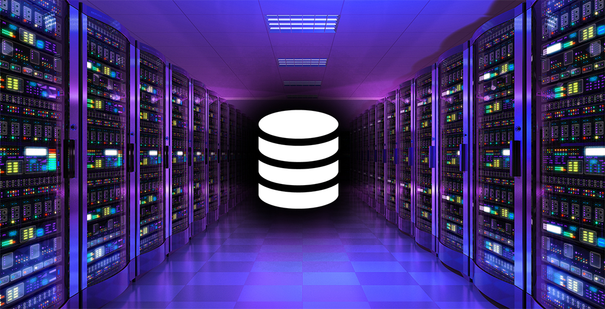

# Data Concepts

<p align="center">
  
</p>

## Table of Contents

- [Introduction to Data](#introduction-to-data)
- [Core Data Terminology](#core-data-terminology)
- [Data Lifecycle](#data-lifecycle)
- [Data Types](#data-types)
- [Data Processing Concepts](#data-processing-concepts)
- [Roles in the Data Ecosystem](#roles-in-the-data-ecosystem)

---

## Introduction to Data

### What Is Data?

Data is any raw fact, observation, or measurement that can be stored, processed, and analyzed.  
It can be numbers, text, images, audio, logs, sensor readings, transactions, or any form of digital representation of reality.

Data itself has **no inherent meaning** until it is interpreted in context.

Examples:

- A temperature reading: `22°C`
- A username: `john_doe`
- An image of a cat
- A log entry: `ERROR 504 - Timeout`

Data can come from humans, machines, applications, or automated systems.

### Information vs Data

Although the terms are often used interchangeably, they are not the same.

| Concept | Meaning |
|--------|---------|
| **Data** | Raw facts or observations with no context |
| **Information** | Processed, structured, or contextualized data that is meaningful |
| **Knowledge** | Insights or understanding derived from analyzing information |

**Example:**

- Data: `450`, `500`, `470`
- Information: “Sales increased by 5% this month.”
- Knowledge: “Marketing campaigns drive sales improvement.”

Turning data into information requires:

- Context  
- Processing  
- Structure  
- Interpretation  

### Types of Data Consumers

Different roles and systems interact with data, each with different needs and goals.

#### **1. Humans**

People who use data for decision-making:

- Business leaders → strategic decisions  
- Analysts → reporting and insights  
- Product managers → product metrics  
- Scientists/Researchers → experimentation  

#### **2. Applications**

Software systems that process, transform, or store data:

- Web apps saving user profiles  
- Backend services handling transactions  
- IoT systems receiving sensor readings  

#### **3. Machine Learning Models**

Models consume data to:

- Train patterns  
- Make predictions  
- Detect anomalies  
- Generate new content  

#### **4. Automated Pipelines**

Data pipelines that:

- Extract data from sources  
- Transform data for processing  
- Load data into storage or analytics systems  

Understanding data consumers helps decide:

- Format  
- Storage strategy  
- Access control  
- Performance requirements  

### Why Data Matters in Modern Systems

Modern systems are built on data because it enables smarter and more efficient operations.

#### **1. Decision-Making**

Businesses rely on data-driven decisions instead of intuition:

- Financial forecasting  
- Customer behavior analysis  
- Operational optimization  

#### **2. Personalization**

Data enables tailored experiences:

- Recommendation systems  
- Personalized ads  
- Custom dashboards  

#### **3. Automation**

Data powers automated workflows:

- Monitoring and alerts  
- Fraud detection  
- Chatbots and customer support  

#### **4. Performance Monitoring**

Applications use data to track:

- Uptime  
- Errors  
- User interactions  
- System metrics  

#### **5. AI/ML Advancements**

Machine learning models depend heavily on:

- Clean  
- Structured  
- Representative  
datasets.

Without high-quality data, even the best algorithms fail.

### Data in AI/ML Pipelines

Data is the **foundation** of any AI or machine learning system.

A typical ML pipeline includes:

#### **1. Data Collection**

Gathering raw data from various sources:

- APIs  
- Databases  
- Logs  
- Sensors  
- Web scraping  

#### **2. Data Cleaning**

Fixing quality issues:

- Missing values  
- Outliers  
- Duplicates  
- Incorrect formats  

#### **3. Data Labeling**

Adding labels or annotations for supervised learning:

- Classifying images  
- Tagging sentiment  
- Marking entities in text  

#### **4. Feature Engineering**

Transforming raw data into input features:

- Normalization  
- Tokenization  
- Aggregations  
- Domain-specific transformations  

#### **5. Data Splitting**

Preparing training, validation, and test sets.

#### **6. Model Training & Evaluation**

Using data to train, tune, and benchmark models.

#### **7. Deployment & Monitoring**

Models use real-time data to make predictions, and performance is monitored via:

- Drift detection  
- Logging  
- Retraining pipelines  

Data quality, structure, and availability determine:

- Model accuracy  
- Model stability  
- System reliability  

**In short: Good data → Good models → Better systems.**

---

## Core Data Terminology

### Dataset

A **dataset** is a structured collection of data.  
It can be as simple as a small table in Excel or as large as terabytes of log files stored in a data lake.

Examples:

- A table of customers (rows = customers, columns = attributes)
- A folder of images used for training a neural network
- A CSV file containing financial transactions
- A large distributed dataset in Hadoop or Spark

Good datasets usually have:

- A consistent structure  
- No or minimal missing data  
- Properly defined metadata  
- Clear purpose (analytics, ML, reporting, etc.)

### Data Point / Record

A **data point**, also called a **record**, **row**, or **instance**, is a single observation in a dataset.

Examples:

- A single customer's profile
- One sensor reading from an IoT device
- An individual image in a dataset
- A single transaction entry

In a tabular dataset, a data point = **one row**.

In image datasets, a data point = **one image + optional label**.

### Feature / Attribute / Field

A **feature** is an individual measurable property or characteristic of a data point.

Synonyms:

- Attribute  
- Column  
- Field  

Examples:

- Age of a customer  
- Price of a product  
- Color histogram in an image  
- Word count in a text  

In machine learning, features are inputs to a model.

Good features:

- Are relevant  
- Are clean and consistent  
- Follow expected formats  
- Improve model performance  

### Label / Target

A **label** (or **target**) is the output the model is trying to predict.

Examples:

- Email → spam or not spam (binary classification)
- Image → class name (multi-class classification)
- House features → house price (regression)
- Sentence → sentiment score (NLP classification)

Not all datasets have labels:

- **Supervised learning** → labels exist  
- **Unsupervised learning** → no labels  

Labels must be:

- Accurate  
- Consistent  
- Representative of the real problem  

Incorrect labels cause **model degradation and bias**.

### Schema

A **schema** defines the structure of data.

It describes:

- Field names  
- Data types  
- Relationships between data  
- Required vs optional fields  
- Constraints (unique, nullable, ranges, etc.)  

Example (table schema for a “users” table):

| Field | Type | Constraint |
|-------|------|------------|
| id | INT | Primary Key |
| name | VARCHAR | Not Null |
| age | INT | Nullable |
| created_at | TIMESTAMP | Not Null |

Schemas ensure:

- Data consistency  
- Data validation  
- Data integrity  

### Metadata

**Metadata** is “data about data.”

It describes:

- Where data came from (source)  
- When it was created  
- Who owns it  
- What format it uses  
- How often it updates  
- Its purpose  

Types of metadata:

- **Technical metadata** → schema, data types  
- **Business metadata** → meaning of fields  
- **Operational metadata** → lineage, refresh time  
- **Descriptive metadata** → tagging, comments  

Metadata is essential for:

- Data governance  
- Understanding datasets  
- Ensuring quality  
- Maintaining pipelines  

### Data Model

A **data model** organizes data and defines how it relates to other data.

Levels of modeling:

1. **Conceptual Model** — high-level business entities  
2. **Logical Model** — detailed representation (tables, relationships)  
3. **Physical Model** — actual implementation (indexes, partitions)

Types of data models:

- Relational model (tables)
- Document model (JSON-like documents)
- Graph model (nodes and edges)
- Key-value model
- Columnar model

Data modeling ensures:

- Efficient storage  
- Accurate representation  
- Stability of systems  
- Fast querying  

### Query

A **query** is a request for data from a data system.

Most common query language: **SQL (Structured Query Language)**.

Queries allow you to:

- Read data (SELECT)  
- Insert data (INSERT)  
- Update data (UPDATE)  
- Delete data (DELETE)  
- Join multiple tables  
- Filter and aggregate data  

Examples:

```sql
SELECT name, age FROM users WHERE age > 30;
```

Other query types:

- NoSQL queries (MongoDB, Cassandra)
- Search queries (Elasticsearch)
- Graph queries (Cypher/Gremlin)
- API queries (REST, GraphQL)

### Data Store

A broad term referring to any system where data is saved.

- Text files
- JSON files
- Databases
- Caches
- Object storage (S3, GCS)

It does not imply structure or query capability.

### Database

A structured data storage system with:

- Defined schema (in SQL databases)
- Query capability
- Data consistency rules
- Indexing

Types:

- SQL databases (PostgreSQL, MySQL)
- NoSQL databases (MongoDB, Cassandra)

Databases are used for:

- Real-time applications
- Transactional systems (OLTP)
- User data
- Logs
- Configurations

### Data Warehouse

A large-scale system optimized for:

- Analytics
- Reporting
- Business intelligence
- Historical analysis

Examples:

- Snowflake
- Google BigQuery
- Amazon Redshift

Key characteristics:

- Designed for OLAP (analytical queries)
- Handles huge datasets
- Uses columnar storage for speed
- Often fed via ETL/ELT pipelines

### Data Lake

A centralized storage system that holds raw, unprocessed, and unstructured data.

Examples:

- Amazon S3
- Azure Data Lake
- Hadoop HDFS

Characteristics:

- Stores data in any format
- Highly scalable
- Cheap storage
- Used for ML, big data, research

Data lakes often lack:

- Strict schemas
- Strong query capabilities (until processed)

### Comparison

| Term | Meaning | Purpose | Typical Users | Example Technologies |
|------|---------|---------|----------------|-----------------------|
| **Dataset** | A collection of related data points. Usually a file, table, or folder of structured or unstructured data. | Used for analysis, ML training, reporting, research. | Data scientists, analysts, ML engineers. | CSV files, image folders, Kaggle datasets |
| **Data Store** | Any location where data is kept. Broadest term — can be structured or unstructured. | General storage. Can be temporary or permanent. | Any system/application. | Local disks, object storage (S3, GCS), Redis |
| **Database** | A structured data system with indexing, constraints, and query capabilities. | Real-time operations, transactional systems, CRUD operations. | Backend developers, DBAs, data engineers. | PostgreSQL, MySQL, MongoDB |
| **Data Warehouse** | Analytics-optimized system storing historical, cleaned, structured data. | BI, dashboards, advanced analytics, OLAP queries. | Analysts, BI developers, business teams. | Snowflake, Redshift, BigQuery |
| **Data Lake** | Centralized storage for raw, unprocessed, unstructured data at massive scale. | ML, big data, experimentation, data exploration. | Data engineers, ML engineers, researchers. | S3, Azure Data Lake, Hadoop HDFS |

The terms sound similar, and beginners often confuse them.  
Here is a clear, intuitive breakdown using simple explanations and real-world analogies.

**Dataset:**

- A **dataset** is the smallest, simplest unit in data work.  
- It is *not* a system — it is just a **collection of related data**.
- Think of a dataset as: *A “document” or “file” you work with directly.*
- A dataset **lives inside** a data store, database, warehouse, or lake.

**Data Store:**

- A **data store** is **any place data is saved**, without implying structure, schema, or query abilities.
- Think of a data store as: *A storage container — like a hard drive or a cloud bucket.*
- Databases, warehouses, and data lakes are **specialized types** of data stores.
- Does NOT guarantee structure  
- Does NOT guarantee query capabilities  
- Can be temporary or permanent

**Database:**

- A **database** is a *structured* data store designed for fast reads/writes, strict consistency, schema enforcement, real-time applications, transactional operations (OLTP).
- Think of a database as: *A highly organized filing cabinet with rules, indexes, and fast access.*
- Databases are NOT optimized for massive analytics or large-scale historical data.
- Usually handles **current**, **operational** data  
- Supports complex **queries** (SQL, NoSQL)  
- Enforces **constraints** (unique, foreign keys, etc.)  
- Good for apps: user accounts, orders, logs  

**Data Warehouse:**

- A **data warehouse** is a database specifically optimized for analytics, reporting, business intelligence, massive aggregation, historical data.
- Think of a data warehouse as: *A huge library of clean, curated, historical data used for analysis.*
- Stores **cleaned**, **structured**, **historical** data  
- Uses **columnar storage** (fast for analytics)  
- Supports **OLAP** (analytical queries)  
- Not meant for real-time writes  
- Often fed via **ETL/ELT pipelines**  
- Good for Dashboards, Yearly reports, Global metrics, Company-wide analytics  
- Not good for Fast operational queries and Real-time application workloads

**Data Lake:**

- A **data lake** is a massive storage system that keeps **any** data in **raw**, **unprocessed**, **unstructured**, or **semi-structured** forms.
- Think of a data lake as: *A huge digital “dumping ground” where you store everything — logs, images, raw CSVs, JSON, sensor data… everything.*
- Extremely scalable  
- Very cheap storage  
- Accepts **all formats**  
- Source of truth for ML and big data  
- Weak schema, weak organization  
- Querying often requires extra tools (Spark, Presto, Athena)  
- Good for Machine learning, Research, Data exploration, Big data processing  
- Not good for Traditional CRUD, Strict integrity requirements, Real-time transactional queries  

| Goal | Use |
|------|-----|
| Store ANY kind of raw data cheaply | **Data Lake** |
| Store structured, cleaned data for analytics and dashboards | **Data Warehouse** |
| Store structured data for apps and transactional workloads | **Database** |
| Save or load data from any system, regardless of format | **Data Store** |
| A specific file or table to analyze or train an ML model | **Dataset** |

---

## Data Lifecycle

The **data lifecycle** describes the journey of data from creation to deletion.  
Understanding it is crucial for managing data effectively, ensuring quality, and enabling analytics and AI applications.

### Data Generation

Data is first **created or generated** by various sources.  
It can originate from:

- **Humans:** form submissions, social media posts, surveys  
- **Machines:** sensors, IoT devices, logs, automated scripts  
- **Applications:** transactions, CRM systems, web apps  
- **External Sources:** APIs, public datasets, purchased data

**Key Points:**

- Determines the type and quality of data available  
- Helps define how data should be captured and stored  
- Influences downstream processing and analysis  

### Data Collection

Data collection is the **process of capturing or acquiring data** from its sources.

Methods:

- Manual input (forms, surveys)  
- Automated pipelines (ETL, streaming)  
- Web scraping  
- APIs and integrations  
- Logs from servers and devices  

**Best Practices:**

- Ensure accuracy at the source  
- Minimize errors and duplicates  
- Use consistent formats  
- Track metadata (source, timestamp, ownership)

### Data Storage

After collection, data must be **stored safely and efficiently**.

Storage types:

- **File-based storage:** CSV, JSON, images  
- **Databases:** relational or NoSQL  
- **Data warehouses:** structured, analytics-ready  
- **Data lakes:** raw, unstructured, or semi-structured  

**Considerations:**

- Security and access control  
- Redundancy and backup  
- Scalability for growing datasets  
- Format choice (structured vs unstructured)  

### Data Processing

Data processing converts **raw data into usable form**.

Steps include:

- Cleaning: remove duplicates, correct errors  
- Validation: ensure data meets expected format and constraints  
- Aggregation: summarize data (e.g., totals, averages)  
- Filtering: keep relevant data only  

**Types of Processing:**

- **Batch processing:** large chunks at intervals  
- **Real-time/stream processing:** continuous ingestion and processing  

Processing is essential before analysis, visualization, or machine learning.

### Data Transformation

Data transformation is the process of **changing data to a different format, structure, or representation**.

Common transformations:

- Normalization / Standardization  
- Encoding categorical variables  
- Feature engineering for ML  
- Aggregation and pivoting  
- Conversion between formats (JSON ↔ CSV ↔ Parquet)

**Purpose:**

- Make data compatible with systems or models  
- Improve analysis or model accuracy  
- Ensure consistency across sources  

### Data Analysis

Data analysis extracts **meaningful insights** from processed and transformed data.

Methods:

- Descriptive: summarize patterns (mean, median, distributions)  
- Diagnostic: find causes of observed behavior  
- Predictive: forecast future trends (ML models)  
- Prescriptive: suggest actions based on analysis  

Tools:

- Python (Pandas, NumPy)  
- R  
- Excel / Power BI / Tableau  
- SQL for querying  

### Data Visualization

Data visualization presents **data insights in a visual format**.

Purpose:

- Identify trends, patterns, and anomalies  
- Communicate insights to stakeholders  
- Simplify complex datasets  

Common visualizations:

- Bar charts, line graphs, pie charts  
- Histograms, boxplots  
- Heatmaps, scatter plots  
- Dashboards (Power BI, Tableau, Plotly)  

Best Practices:

- Choose the right chart type  
- Keep visuals clear and uncluttered  
- Highlight key insights  

### Data Archiving

Data archiving is the **long-term storage of data** that is no longer actively used but may be needed later.

Characteristics:

- Often moved to cheaper storage (tape, cold storage, cloud archives)  
- Stored in a format suitable for retrieval  
- Retains important historical information for compliance, audits, or research  

Key Considerations:

- Data retention policies  
- Metadata for easy retrieval  
- Security and access control  

### Data Deletion

Data deletion is the **final stage** in the lifecycle when data is no longer needed.

Reasons for deletion:

- End of retention period  
- Reducing storage costs  
- Privacy and compliance (e.g., GDPR right to be forgotten)  

Methods:

- Logical deletion (mark as deleted)  
- Physical deletion (remove from storage)  
- Secure deletion (overwrite, encryption wipe)  

**Best Practices:**

- Follow legal and regulatory requirements  
- Ensure backups do not contain deleted data  
- Audit deletion processes for compliance  

---

## Data Types

Data comes in many forms, and understanding its types is crucial for storage, processing, and analysis.  
Each type has different characteristics, requirements, and use cases.

### Structured Data

**Structured data** is organized and stored in a fixed format, usually in rows and columns of databases or spreadsheets.

Characteristics:

- Defined schema (columns and data types)  
- Easy to query with SQL  
- Highly organized and consistent  

Examples:

- Customer names and emails in a CRM  
- Transaction logs in a banking system  
- Inventory lists in a warehouse  

Use Cases:

- Relational databases  
- Business analytics  
- Reporting dashboards  

### Semi-Structured Data

**Semi-structured data** has some organizational properties but does not fit neatly into tables.

Characteristics:

- Flexible schema  
- Often hierarchical or nested  
- Can contain metadata  

Examples:

- JSON or XML files  
- NoSQL document databases (MongoDB, CouchDB)  
- Event logs with key-value pairs  

Use Cases:

- APIs and web services  
- Flexible storage for evolving data  
- Data integration from multiple sources  

### Unstructured Data

**Unstructured data** has no predefined format or structure.  

Characteristics:

- Cannot be stored directly in relational tables  
- Requires specialized processing  
- Often large in size  

Examples:

- Text documents, emails  
- Images, audio, video  
- Social media posts  

Use Cases:

- NLP and text analytics  
- Image recognition  
- Video analysis  
- Big data pipelines  

### Time-Series Data

**Time-series data** represents observations indexed by time.

Characteristics:

- Ordered sequence  
- Regular or irregular intervals  
- Often numeric measurements  

Examples:

- Stock prices  
- IoT sensor readings  
- Server CPU usage logs  

Use Cases:

- Forecasting and trend analysis  
- Monitoring systems  
- Anomaly detection  

### Geospatial Data

**Geospatial data** represents information tied to locations on Earth.

Characteristics:

- Coordinates (latitude, longitude)  
- Can include polygons, lines, points  
- Often large and multidimensional  

Examples:

- GPS tracking data  
- Maps and satellite imagery  
- Location-based services  

Use Cases:

- Navigation apps  
- Urban planning  
- Environmental monitoring  
- Geographic analytics  

### Streaming vs Batch Data

**Batch Data:**  

- Collected and processed in chunks at intervals  
- Examples: daily sales reports, monthly financial records  

**Streaming Data:**  

- Continuous flow of data, processed in near real-time  
- Examples: live sensor readings, website clickstreams, Kafka streams  

Choosing the right approach depends on:

- Real-time vs historical requirements  
- System architecture  
- Data volume and velocity  

### Categorical vs Numerical

**Categorical Data:**  

- Represents discrete groups or labels  
- Examples: gender, product type, city  
- Can be **nominal** (no order) or **ordinal** (ordered)  

**Numerical Data:**  

- Represents measurable quantities  
- Examples: age, temperature, price  
- Can be **continuous** or **discrete**  

### Discrete vs Continuous

**Discrete Data:**  

- Can only take specific values, usually integers  
- Examples: number of customers, number of defects  

**Continuous Data:**  

- Can take any value within a range  
- Examples: height, weight, temperature  

Understanding this helps in selecting the right analysis, visualization, and ML algorithms.

### Text, Audio, Image, Video Data

**Text Data:**  

- Natural language, documents, chat logs  
- NLP techniques for analysis  

**Audio Data:**  

- Voice recordings, music, sensor audio  
- Processed using signal processing or ML  

**Image Data:**  

- Photos, medical scans, satellite images  
- Processed with computer vision techniques  

**Video Data:**  

- Sequences of images with temporal information  
- Used in surveillance, streaming analytics, and ML  

**Key Notes:**

- Unstructured in nature  
- Requires specialized storage, formats, and processing tools  
- Often large in size, demanding scalable systems  

---

## Data Processing Concepts

Data processing refers to the methods and workflows used to convert raw data into meaningful insights or actionable formats. Understanding these concepts is essential for building efficient data pipelines and analytics systems.

### Batch Processing vs Real-Time Processing

**Batch Processing:**  

- Processes data in large chunks or batches at scheduled intervals.  
- Suitable for large volumes of historical data.  
- Examples: daily sales reports, monthly analytics, ETL pipelines.  

**Real-Time Processing (Stream Processing):**  

- Processes data continuously as it arrives.  
- Suitable for time-sensitive applications.  
- Examples: fraud detection, live dashboards, IoT sensor monitoring.  

**Key Differences:**

| Feature | Batch | Real-Time |
|---------|-------|-----------|
| Timing | Periodic | Continuous |
| Latency | High | Low |
| Complexity | Lower | Higher |
| Use Cases | Reporting, analytics | Monitoring, alerts, streaming ML |

### ETL vs ELT

Both ETL and ELT are methods for moving and preparing data, but they differ in **when transformation occurs**.

**ETL (Extract, Transform, Load):**  

- Extract data from sources  
- Transform it before loading  
- Load clean data into destination (data warehouse)  
- Common in traditional BI pipelines  

**ELT (Extract, Load, Transform):**  

- Extract data from sources  
- Load raw data into destination (data lake or lakehouse)  
- Transform data within the system  
- Common in modern big data and cloud architectures  

**Key Considerations:**  

- ETL: better for controlled environments and strict data quality  
- ELT: better for scalable, flexible processing with large datasets  

### Data Transformation Techniques

Data transformation changes data into a usable or standardized format for analysis or machine learning.

Common techniques:

- **Normalization / Standardization** – scale numerical values  
- **Encoding categorical variables** – one-hot, label encoding  
- **Aggregation** – summing, averaging, grouping  
- **Filtering** – removing irrelevant data  
- **Pivoting / Unpivoting** – restructuring tables  
- **Deriving features** – creating new features from existing ones  

Purpose:

- Improve model performance  
- Ensure compatibility with target systems  
- Maintain consistency across multiple sources  

### Data Integration

Data integration combines data from multiple sources into a unified view.

Methods:

- **ETL pipelines** – extract, transform, and load into a central warehouse  
- **API integrations** – real-time or periodic data fetching  
- **Data federation** – virtual integration without physical storage  
- **Master Data Management (MDM)** – ensuring a single source of truth  

Challenges:

- Handling heterogeneous formats  
- Synchronizing updates  
- Maintaining data quality and consistency  

Benefits:

- Provides a holistic view of the business  
- Supports analytics, ML, and reporting  
- Reduces redundancy and conflicts  

### Data Modeling (Conceptual, Logical, Physical)

Data modeling defines how data is structured and related.

**1. Conceptual Model:**  

- High-level, abstract representation  
- Focuses on business entities and relationships  
- Example: "Customer" interacts with "Orders"  

**2. Logical Model:**  

- Detailed structure without considering physical implementation  
- Defines tables, columns, keys, and relationships  
- Example: "Customers" table with primary key `customer_id` and foreign key in "Orders" table  

**3. Physical Model:**  

- Implementation-specific design  
- Includes indexing, partitions, storage type, and constraints  
- Example: PostgreSQL or Cassandra schema with storage optimization  

Purpose:

- Ensures data consistency  
- Facilitates efficient storage and querying  
- Provides a blueprint for database or warehouse implementation

---

## Roles in the Data Ecosystem

The data ecosystem consists of multiple specialized roles, each responsible for different parts of the data lifecycle. Understanding these roles helps in building effective teams and workflows.

### Data Scientist

**Role:** Extracts insights and builds predictive models using data.  

**Responsibilities:**

- Analyzing datasets to identify patterns  
- Feature engineering and selection  
- Building, testing, and tuning machine learning models  
- Communicating findings to stakeholders  

**Skills:**

- Python, R, SQL  
- Statistics and probability  
- Machine learning algorithms  
- Data visualization  

**Tools:**  

- Pandas, NumPy, scikit-learn, TensorFlow, PyTorch, Jupyter  

### Data Analyst

**Role:** Focuses on interpreting data and providing actionable insights.  

**Responsibilities:**

- Cleaning and preparing data for analysis  
- Creating reports and dashboards  
- Performing descriptive and diagnostic analytics  
- Supporting business decisions with data  

**Skills:**

- Excel, SQL, Tableau, Power BI  
- Basic statistics  
- Data visualization techniques  

**Tools:**  

- Excel, Tableau, Power BI, SQL, Python/R (optional)  

### Data Engineer

**Role:** Designs and maintains the infrastructure to collect, store, and process data at scale.  

**Responsibilities:**

- Building and managing data pipelines (ETL/ELT)  
- Ensuring data quality, consistency, and availability  
- Managing databases, data warehouses, and data lakes  
- Optimizing storage, querying, and performance  

**Skills:**

- SQL, Python, Java, Scala  
- Big data tools (Hadoop, Spark, Kafka)  
- Cloud platforms (AWS, GCP, Azure)  
- Workflow orchestration (Airflow, Prefect)  

**Tools:**  

- Spark, Kafka, Hadoop, Airflow, DBMS, Cloud storage  

### Database Administrator (DBA)

**Role:** Maintains databases and ensures their reliability, security, and performance.  

**Responsibilities:**

- Installing and configuring databases  
- Backup and recovery management  
- Monitoring performance and optimizing queries  
- Managing access control and security  

**Skills:**

- SQL and database internals  
- Database tuning and optimization  
- Security and compliance knowledge  
- Backup/restore strategies  

**Tools:**  

- MySQL, PostgreSQL, Oracle, SQL Server  
- Monitoring tools like Nagios, Prometheus  

### Machine Learning Engineer

**Role:** Bridges the gap between data science and production systems by deploying models at scale.  

**Responsibilities:**

- Deploying trained ML models into production  
- Building scalable ML pipelines  
- Monitoring model performance and drift  
- Collaborating with data engineers and data scientists  

**Skills:**

- Python, ML frameworks (TensorFlow, PyTorch)  
- Docker, Kubernetes, CI/CD for ML  
- Data preprocessing and feature engineering  
- Cloud services for ML deployment  

**Tools:**  

- TensorFlow, PyTorch, MLflow, Kubeflow, AWS SageMaker, Docker, Kubernetes  

### Comparison of Roles in the Data Ecosystem

The roles in the data ecosystem overlap in some areas but are distinct in focus, skill sets, and responsibilities. Here’s a comparison table for clarity:

| Role | Focus | Key Responsibilities | Skills | Tools | Primary Goal |
|------|-------|--------------------|--------|-------|--------------|
| **Data Scientist** | Insights and predictive models | Data analysis, ML modeling, feature engineering, communicating insights | Python/R, ML, Statistics, Data Visualization | Pandas, scikit-learn, TensorFlow, PyTorch, Jupyter | Extract actionable insights and build predictive models |
| **Data Analyst** | Data interpretation and reporting | Cleaning data, dashboards, descriptive & diagnostic analysis | SQL, Excel, Tableau/Power BI, basic stats | Excel, Tableau, Power BI, SQL | Provide actionable insights and support decision-making |
| **Data Engineer** | Data infrastructure and pipelines | Building/maintaining data pipelines, storage optimization, ensuring data quality | SQL, Python, Big Data (Spark/Hadoop/Kafka), Cloud | Spark, Kafka, Hadoop, Airflow, DBMS | Ensure data is accessible, reliable, and scalable |
| **Database Administrator (DBA)** | Database management | Installing/configuring DBs, backup/recovery, security, performance tuning | SQL, DB internals, Optimization, Security | MySQL, PostgreSQL, Oracle, Monitoring tools | Maintain database reliability, security, and performance |
| **Machine Learning Engineer** | ML deployment and production | Deploy ML models, build scalable pipelines, monitor models | Python, ML frameworks, Docker/K8s, Cloud | TensorFlow, PyTorch, MLflow, Kubeflow, SageMaker | Deploy and maintain ML models in production |

- **Data Scientists** focus primarily on deriving insights from data and building predictive models. They spend most of their time exploring data, performing statistical analysis, and creating machine learning models.
- **Data Analysts** focus on understanding and interpreting data for business decision-making. They often use BI tools and dashboards to visualize and communicate findings.
- **Data Engineers** handle the technical backbone: creating data pipelines, ensuring data flows reliably from source to storage and analysis tools, and making data available for downstream users.
- **DBAs** specialize in database maintenance, ensuring databases run efficiently, securely, and are backed up and recoverable.
- **Machine Learning Engineers** operationalize data science work, deploying models into production, monitoring their performance, and ensuring they scale in real-time systems.

While all roles interact with data, their responsibilities differ along the lifecycle:

- Analysts and scientists use the data.
- Engineers and DBAs build the infrastructure.
- ML engineers bridge the two, putting models into production.  

Understanding these distinctions helps organizations build complementary teams where each role adds value without overlapping unnecessarily.

---

## Note

```text
I will update this tutorial if I acquire any new information.
```

## Sources

```text
NaN
```
