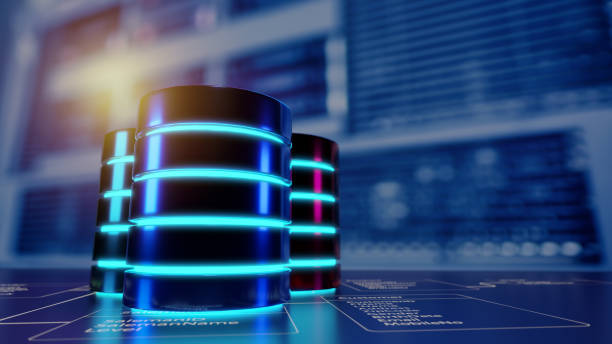
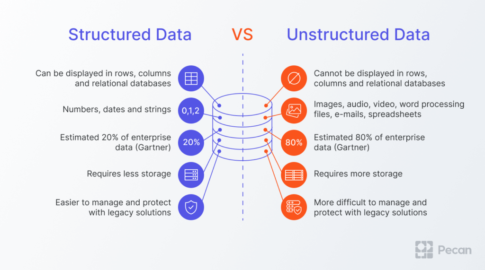

# Database

<p align="center">
  
</p>

## Table of Contents

- [Introduction to Databases](#introduction-to-databases)
- [Database Types](#database-types)
- [Core Database Concepts](#core-database-concepts)
- [Comparison and Selection Criteria](#comparison-and-selection-criteria)
- [Must-Know Databases for Full Stack AI Developers](#must-know-databases-for-full-stack-ai-developers)

---

## Introduction to Databases

Databases are the backbone of modern applications and AI systems. They organize, store, and manage data efficiently, making it accessible for analysis, machine learning, and operational systems.

### What is a Database?

A **database** is a structured system for storing, retrieving, and managing data.  
It allows users and applications to **store large amounts of data**, **perform queries efficiently**, and **ensure consistency and integrity**.

Key points:

- Stores data in **organized formats** (tables, documents, key-value pairs, etc.)  
- Provides mechanisms for **querying, indexing, and updating** data  
- Enforces rules to maintain **accuracy and consistency**  
- Supports **multiple users** and applications concurrently  

Examples:

- Customer data in an e-commerce platform  
- Transaction logs in a banking system  
- Sensor data collected from IoT devices  
- Text documents, images, or videos stored for analytics  

### Why Databases Exist

Databases solve fundamental challenges of data management that simple file storage cannot handle efficiently:

1. **Organization:** Tables, documents, or key-value stores structure data for easy access.  
2. **Efficiency:** Query engines and indexing provide fast access to large datasets.  
3. **Consistency:** Enforce rules to maintain accurate and reliable data.  
4. **Concurrency:** Allow multiple users or applications to access data simultaneously without conflicts.  
5. **Durability and Recovery:** Ensure data persists and can be restored in case of failures.  

Without databases:

- Applications would rely on flat files, which are slow and prone to errors  
- Data integrity and relationships would be hard to maintain  
- Scaling systems for millions of users or terabytes of data would be extremely difficult  

### Structured vs Unstructured Storage

**Structured Storage:**

- Organizes data in predefined formats (tables, rows, and columns)  
- Examples: MySQL, PostgreSQL, Oracle  
- Ideal for: transactions, reporting, relational analytics  
- Pros: Easy to query, ensures consistency  
- Cons: Rigid schema, harder to handle unstructured data  

**Unstructured Storage:**

- Stores data without a fixed schema or format  
- Examples: HDFS, object storage (S3), NoSQL document stores  
- Ideal for: logs, images, audio, video, free-form text  
- Pros: Flexible, scalable, can store any data type  
- Cons: Harder to query directly, requires processing or indexing  



**Semi-Structured:**  

- A hybrid where data has some structure but is flexible (JSON, XML)  
- Bridges the gap between structured and unstructured systems  

### When to Use a Database

A database is the right choice when you need:

- **Reliable storage** for large volumes of data  
- **Fast retrieval and querying** of data  
- **Data integrity** with enforced constraints  
- **Multi-user access** and concurrency control  
- **Transaction support** for critical operations  
- **Scalability** for growing applications or AI systems  

Common scenarios:

- E-commerce: managing customers, orders, and inventory  
- Banking: tracking transactions and accounts  
- AI/ML: storing training datasets, feature stores, and logs  
- Analytics: collecting and querying structured and unstructured data for insights  

---

## Database Types

Modern applications and AI systems require different database types to meet specific performance, scalability, and flexibility needs. Choosing the right type depends on the nature of the data and how it will be used.

### Relational Databases (RDBMS)

**Relational databases** store data in structured tables with rows and columns, enforcing a predefined schema. They are ideal for transactional and structured data.

**Key Features:**

- Structured schema with tables, rows, and columns  
- Relationships enforced through foreign keys  
- ACID compliance (Atomicity, Consistency, Isolation, Durability)  
- Supports SQL for querying  

**Use Cases:**

- Banking systems for transactions  
- E-commerce platforms for orders and customers  
- Enterprise applications requiring reliable, consistent data  

**Examples:** MySQL, PostgreSQL, Oracle, SQLite  

**Pros:**  

- Strong consistency  
- Mature ecosystems  
- Easy to query and manage structured data  

**Cons:**  

- Limited flexibility for unstructured or semi-structured data  
- Scaling horizontally can be challenging  

### NoSQL Databases

**NoSQL databases** are designed for flexibility, scalability, and handling diverse data types. They do not require a fixed schema and can efficiently manage unstructured or semi-structured data.

#### Document Stores

- Store data as JSON, BSON, or XML documents  
- Each document can have different fields  
- Examples: MongoDB, CouchDB  
- Use Cases: Content management, user profiles, catalogs  

#### Key-Value Stores

- Data is stored as a simple key-value pair  
- Extremely fast for lookups by key  
- Examples: Redis, DynamoDB  
- Use Cases: Caching, session management, real-time analytics  

#### Columnar Stores

- Store data by columns rather than rows  
- Optimized for analytical queries on large datasets  
- Examples: Cassandra, HBase  
- Use Cases: Big data analytics, time-series data  

#### Graph Databases

- Store data as nodes, edges, and properties  
- Designed for relationships and connections  
- Examples: Neo4j, ArangoDB  
- Use Cases: Social networks, recommendation engines, fraud detection  

**Pros:**  

- Flexible schema  
- Scalable horizontally  
- Optimized for specific workloads  

**Cons:**  

- Consistency can vary depending on system (CAP theorem)  
- Query languages are often less standardized than SQL  

### Distributed Databases

**Distributed databases** spread data across multiple machines to improve scalability, reliability, and performance.

**Key Features:**

- Data partitioning (sharding) across nodes  
- Replication for redundancy and fault tolerance  
- Can support high availability and horizontal scaling  

**Use Cases:**

- Global applications serving millions of users  
- Real-time analytics pipelines  
- Large-scale cloud applications  

**Examples:** Cassandra, CockroachDB, Google Spanner  

**Pros:**  

- Handles massive datasets efficiently  
- High availability and fault tolerance  

**Cons:**  

- More complex architecture  
- Can introduce eventual consistency issues  

### Big Data Storage (HDFS, Hadoop, Spark)

**Big Data storage** solutions are designed to store and process extremely large datasets, often in distributed environments.

#### HDFS (Hadoop Distributed File System)

- Distributed file system designed for large-scale storage  
- Stores data in blocks across multiple nodes  
- Optimized for batch processing  

#### Hadoop

- Framework for distributed storage and processing of large datasets  
- Includes HDFS, MapReduce, and ecosystem tools  

#### Apache Spark

- Fast, in-memory data processing framework  
- Can handle batch and real-time streaming  
- Works on top of HDFS or other storage layers  

**Use Cases:**

- Analytics on terabytes or petabytes of data  
- Machine learning pipelines with large datasets  
- Processing unstructured or semi-structured data at scale  

**Pros:**  

- Scales horizontally for massive datasets  
- Supports batch and stream processing  
- Integrates with multiple storage types  

**Cons:**  

- Requires specialized skills to operate  
- Can be complex to maintain and optimize

---

## Core Database Concepts

Understanding core database concepts is essential for designing, querying, and maintaining efficient and reliable database systems. These concepts apply across relational, NoSQL, and distributed databases.

### Tables, Rows, Columns

**Tables** store data in a structured format with rows and columns (RDBMS) or collections in document stores.  

- **Rows (Records):** Each row represents a single entity or record.  
- **Columns (Fields/Attributes):** Each column represents a property or attribute of the entity.  

Example:

| CustomerID | Name   | Email           |
|------------|--------|----------------|
| 1          | Alice  | <alice@email.com> |
| 2          | Bob    | <bob@email.com>   |

Purpose:

- Organize data for efficient storage and retrieval  
- Facilitate relationships between entities  

### Keys: Primary, Foreign, Composite

**Primary Key:**  

- Uniquely identifies each record in a table  
- Example: `CustomerID` in a customers table  

**Foreign Key:**  

- Links records across tables to maintain relationships  
- Example: `Order.CustomerID` referencing `Customers.CustomerID`  

**Composite Key:**  

- Combines two or more columns to form a unique identifier  
- Example: `OrderID + ProductID` to uniquely identify order items  

Purpose:

- Ensure uniqueness and data integrity  
- Maintain relationships between tables  

### Indexing and Query Optimization

**Indexing:**  

- Improves query performance by creating fast access paths to data  
- Can be on one or multiple columns (single/multi-column index)  

**Query Optimization:**  

- Database evaluates multiple query plans to choose the most efficient  
- Techniques: indexing, partitioning, caching, query rewriting  

Benefits:

- Reduces query execution time  
- Improves application responsiveness  

### Transactions and ACID Properties

**Transactions:**  

- Group of operations executed as a single unit  
- Either all succeed or all fail  

**ACID Properties:**  

- **Atomicity:** All operations succeed or none do  
- **Consistency:** Database moves from one valid state to another  
- **Isolation:** Transactions do not interfere with each other  
- **Durability:** Once committed, changes persist even after failures  

Purpose:

- Ensures reliability and correctness of database operations  

### CAP Theorem (Consistency, Availability, Partition Tolerance)

**CAP Theorem:** States that in a distributed database, you can only guarantee **two out of three**:

- **Consistency (C):** All nodes see the same data at the same time  
- **Availability (A):** Every request receives a response, even if some nodes fail  
- **Partition Tolerance (P):** System continues to operate despite network failures  

Implications:

- Distributed databases often make trade-offs based on requirements  
- Example: Cassandra favors availability and partition tolerance (eventual consistency)  

### Sharding and Replication

**Sharding (Horizontal Partitioning):**  

- Splits large datasets across multiple database nodes  
- Each node handles a subset of the data  
- Improves performance and scalability  

**Replication:**  

- Copies data across multiple nodes for redundancy and high availability  
- Types: master-slave, multi-master replication  

Purpose:

- Improve scalability, fault tolerance, and disaster recovery  

### Backup and Recovery

**Backup:**  

- Regular snapshots or copies of databases to prevent data loss  
- Types: full, incremental, differential  

**Recovery:**  

- Restoring data from backups after failure or corruption  
- Ensures minimal downtime and data loss  

Best Practices:

- Schedule automated backups  
- Test recovery procedures regularly  
- Store backups in multiple locations  

### Security and Access Control

**Security Measures:**  

- Authentication: Verify user identity (passwords, tokens, multi-factor)  
- Authorization: Define user permissions for read/write/modify operations  
- Encryption: Protect data at rest and in transit  
- Auditing: Track database access and changes  

Purpose:

- Protect sensitive data  
- Prevent unauthorized access  
- Ensure regulatory compliance (GDPR, HIPAA, etc.)

---

## Comparison and Selection Criteria

Different databases are designed to solve different problems. Understanding why multiple databases exist and how to select the right one is critical for building efficient AI and full-stack systems.

### Why Multiple Databases Exist

Databases exist because **no single system can optimally handle all types of data workloads**. Each database type is optimized for:

- **Data structure:** Structured vs unstructured  
- **Access patterns:** Read-heavy vs write-heavy  
- **Scale:** Small vs massive datasets  
- **Consistency requirements:** Strong ACID vs eventual consistency  
- **Latency needs:** Real-time vs batch processing  

Example:

- PostgreSQL is ideal for structured transactional data with complex queries.  
- MongoDB handles flexible, semi-structured JSON data.  
- Redis provides extremely fast key-value access for caching or real-time tasks.  

Multiple databases coexist because each addresses specific requirements efficiently, and no single solution can cover all use cases perfectly.

### Structured vs Flexible Schema

**Structured Schema:**  

- Fixed table structures with predefined columns  
- Enforced constraints and data types  
- Examples: PostgreSQL, MySQL  

**Flexible Schema (Schema-less or Semi-Structured):**  

- No strict format required  
- Allows storing diverse data types  
- Examples: MongoDB, Redis  

**Implications for Selection:**  

- Structured databases are great for transactional systems and analytics  
- Flexible schema databases are ideal for rapidly evolving or heterogeneous data  

### Read-heavy vs Write-heavy Systems

**Read-heavy Systems:**  

- Mostly retrieve data  
- Requires optimized queries and indexing  
- Examples: reporting dashboards, analytics platforms  

**Write-heavy Systems:**  

- Frequent inserts, updates, and deletes  
- Requires fast writes and concurrency control  
- Examples: logging systems, IoT data ingestion  

**Selection Tip:**  

- Choose a database optimized for your primary workload to maintain performance and scalability.

### Scale and Performance Considerations

Key factors:

- **Horizontal vs Vertical Scaling:** Can the system scale by adding nodes or by upgrading a single server?  
- **Latency Requirements:** Does the application need real-time responses or can it handle batch processing?  
- **Data Volume:** Terabytes or petabytes may require distributed or big data systems.  
- **Throughput:** Number of reads/writes per second  

Examples:

- HDFS, Hadoop, and Spark are optimized for large-scale distributed storage and batch processing.  
- Redis is optimized for extremely low-latency read/write access.  

### Cost and Ecosystem Support

**Cost Factors:**

- Licensing (open source vs commercial)  
- Cloud infrastructure and storage costs  
- Maintenance and operational overhead  

**Ecosystem Support:**

- Availability of tools, libraries, and community support  
- Integration with programming languages, BI tools, ML frameworks  
- Compatibility with existing infrastructure  

**Selection Tip:**  

- Open-source options like PostgreSQL, MySQL, and MongoDB provide flexibility and a strong community.  
- Commercial options like Oracle or managed cloud services may offer advanced features and enterprise support.  

**Summary:**  
Choosing the right database involves balancing data type, workload, scale, performance, cost, and ecosystem. Often, a combination of multiple databases is used to achieve optimal results in modern AI and full-stack applications.

---

## Must-Know Databases for Full Stack AI Developers

For a full stack AI developer, knowing a variety of databases is essential. Each database type serves a specific purpose, and understanding their strengths and limitations enables you to design robust, scalable, and efficient AI systems.

### Relational Databases

**Relational databases (RDBMS)** store structured data in tables and support complex queries through SQL. They are ideal for transactional systems, reporting, and analytics.

- **PostgreSQL:**  
  - Open-source, advanced features, ACID-compliant  
  - Supports JSON, full-text search, and procedural languages  
  - Use Cases: analytics, transactional systems, ML feature storage  

- **MySQL:**  
  - Widely used, open-source, easy to set up  
  - Suitable for web applications and general-purpose use  
  - Use Cases: e-commerce platforms, content management  

- **SQLite:**  
  - Lightweight, file-based database  
  - Ideal for embedded applications, prototyping, or local storage  
  - Use Cases: small apps, mobile devices, testing  

- **Oracle:**  
  - Enterprise-grade, commercial RDBMS  
  - Advanced security, scalability, and support  
  - Use Cases: large-scale enterprise systems, financial systems  

### NoSQL Databases

**NoSQL databases** provide flexibility for semi-structured or unstructured data and scale horizontally.

- **MongoDB:**  
  - Document-oriented database storing JSON-like documents  
  - Flexible schema, rich query language  
  - Use Cases: content management, user profiles, ML datasets  

- **Redis:**  
  - In-memory key-value store  
  - Extremely fast read/write operations  
  - Use Cases: caching, real-time analytics, session management  

- **Neo4j:**  
  - Graph database storing nodes and relationships  
  - Optimized for connected data queries  
  - Use Cases: social networks, recommendation systems, fraud detection  

### Big Data / Distributed Storage

**Big data solutions** handle massive datasets across multiple nodes, supporting batch and stream processing.

- **HDFS (Hadoop Distributed File System):**  
  - Distributed file storage optimized for large-scale data  
  - Reliable, fault-tolerant, scalable  

- **Hadoop:**  
  - Framework for distributed storage and batch processing  
  - Includes HDFS, MapReduce, and ecosystem tools  

- **Apache Spark:**  
  - Fast, in-memory data processing framework  
  - Supports batch and real-time analytics, ML pipelines  

**Use Cases:**  

- Large-scale data processing  
- Training machine learning models on terabytes of data  
- Big data analytics pipelines  

### Search and Analytics

- **Elasticsearch:**  
  - Distributed search and analytics engine  
  - Optimized for full-text search, log analytics, and real-time querying  
  - Use Cases: application search, monitoring systems, analytics dashboards  

**Summary:**  
A full stack AI developer should be familiar with relational databases for structured data, NoSQL for flexible or high-performance workloads, big data frameworks for large-scale processing, and search engines for analytics. Combining these tools allows efficient handling of diverse data types in modern AI pipelines.

---

## Note

```text
I will update this tutorial if I acquire any new information.
```

## Sources

```text
Sample
```
