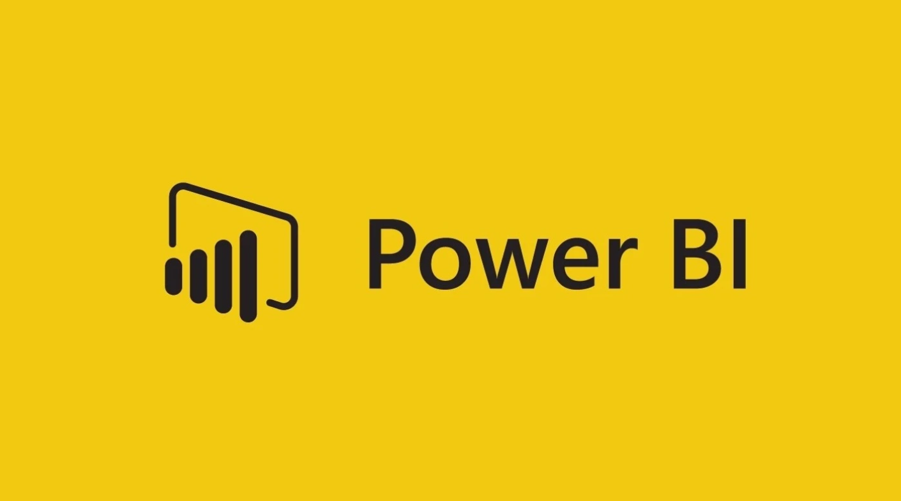
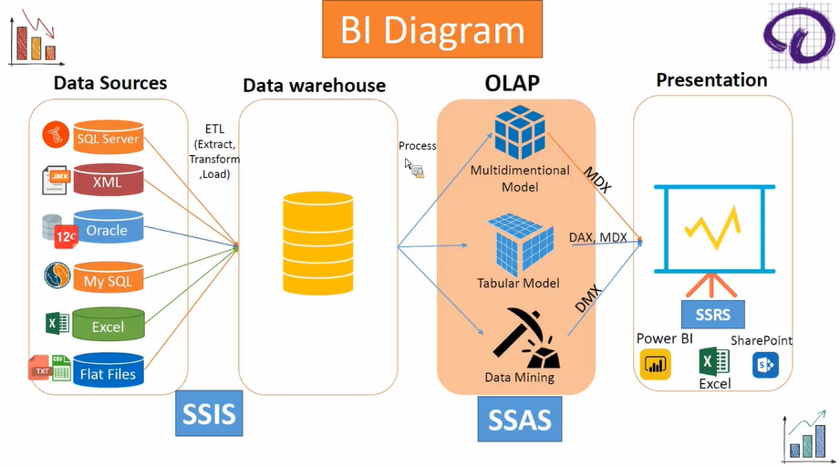
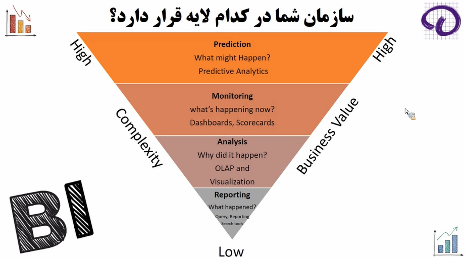

# Power BI

<p align="center">
  
</p>

## Table of Contents

- [Section](#section)

---

## Installation

1. Install Visual Studio Community 2022

- Install .NET desktop development
- Install Data storage and processing
- Install Integration services extention

---

## Introduction

### What is BI?

**Business Intelligence (BI)** is a technology-driven set of processes and tools used to collect, integrate, analyze, and present business data. The goal is to support **better decision-making** for executives, managers, and operational users.

Key points:

- BI converts raw data into **actionable insights**.
- It typically works with data that has been **processed and stored in a data warehouse**, not live operational data.
- Data is usually refreshed **once or twice a day**, unless real-time analysis is required.
- For real-time scenarios, BI tools may read directly from **OLTP systems**, although this is less common due to performance concerns.



### Data Sources

A BI ecosystem can pull data from multiple heterogeneous sources, including:

- Relational databases: SQL Server, MySQL, Oracle, PostgreSQL  
- Flat or semi-structured files: CSV, Excel, JSON, XML  
- Cloud data sources  
- APIs or Web Services  

The goal is to consolidate all operational data to prepare it for analytics.

### SSIS (SQL Server Integration Services)

**SSIS** is a Microsoft ETL (Extract-Transform-Load) tool used to:

- Extract data from various sources  
- Transform it (clean, shape, and standardize)  
- Load it into the **data warehouse**

It is the backbone of data movement in Microsoft-based BI architectures.

### Data Warehouse

A **data warehouse (DW)** is a specialized relational database designed for **analytics**, not transactional work.

Characteristics:

- Stores **cleaned, integrated, historical data**
- Organized for **fast querying and reporting**
- Updated via **ETL**, often once or twice daily
- Used by BI tools as the primary source for analytics

### OLTP

**OLTP (Online Transaction Processing)** refers to systems designed to manage **real-time business transactions**. These are the operational databases used by applications that run the day-to-day functions of a business.

Key Characteristics:

- **High volume of small transactions** (INSERT, UPDATE, DELETE)
- **Highly normalized tables** to reduce redundancy
- **Fast write performance**
- Supports **concurrent users**
- Ensures **data accuracy and consistency** (ACID compliance)
- Stores **current, up-to-date data**

Examples of OLTP Systems:

- Banking systems (money transfer, withdrawal)
- E-commerce checkout systems
- Point-of-sale (POS) systems
- Hospital appointment systems
- Inventory management systems
- ERP and CRM applications

OLTP Database Design:

- **Normalized schema** (3NF or higher)
- Many tables with many relationships
- Optimized for **insert/update** speed
- Very little historical data kept

BI projects *ideally* use a DW, but small systems may connect directly to OLTP systems.

DW vs. OLTP

| Feature | OLTP | Data Warehouse |
|--------|------|-----------------|
| Purpose | Transaction processing | Analytics & reporting |
| Read/Write | Frequent writes | Mostly reads |
| Data Structure | Highly normalized | Often denormalized (star/snowflake) |
| Performance Risk | High under BI load | Designed for BI |

If direct reporting on OLTP is necessary, companies may use features like:

- **Always On Availability Groups**: Power BI or SSAS reads from the **replica server**, reducing load on the primary OLTP server.

We usually have two servers:

- primary: data entry
- replica (secondary): mirror in live

Databases store data in either:

- **Row store**: Optimal for transaction processing.
- **Column store**:  
  - Better compression  
  - Faster analytical queries  
  - Used widely in modern BI and OLAP  
  - Two types: **Clustered Columnstore Index (CCI)** and **Non-Clustered Columnstore Index (NCCI)**

### Process

Data is moved from the warehouse to **OLAP servers** for optimized analytical processing.

### OLAP

**OLAP (Online Analytical Processing)** refers to systems designed to support **complex analytical queries**, reporting, and business intelligence. OLAP systems are optimized for reading large amounts of aggregated data.

Key Characteristics

- Designed for **read-intensive** workloads
- Optimized for **complex analytical queries**
- Uses **denormalized schemas** (star or snowflake)
- Stores **historical data**
- High query performance due to **pre-aggregation** and **columnar storage**
- Supports dashboards, KPIs, and trend analysis

Examples of OLAP Usage

- Sales trend analysis over several years
- Financial forecasting and budgeting
- Customer segmentation
- Inventory demand planning
- Executive dashboards
- KPI monitoring

OLAP Database Design

- **Star schema** (Fact + Dimension tables)
- **Column-store indexing**
- Data is loaded periodically (daily/weekly ETL)
- Supports multi-dimensional analysis:
  - Time
  - Geography
  - Product
  - Customer
  - Etc.

### SSAS

**SQL Server Analysis Services (SSAS)** provides OLAP capabilities and acts as an optimized analytical layer between the warehouse and presentation tools.

Why OLAP?

- SQL alone is not optimized for complex BI queries.
- OLAP provides:
  - Pre-aggregated data
  - Faster multidimensional queries
  - Business-friendly modeling
- OLAP databases are typically **column-store** for speed.

Types of OLAP Models in SSAS:

1. **Multidimensional Model**
   - Uses **MDX** language
   - No practical data volume limits
   - Ideal for very large and complex datasets
   - Legacy technology (Microsoft no longer enhances it)
   - Common in older enterprise systems (e.g., government, banking)

2. **Tabular Model**
   - Uses **DAX** (primary) and some MDX compatibility
   - Same modeling engine used inside **Power BI**
   - Power BI Desktop has a **1 GB model size limit**
   - Fast, memory-based (in-memory VertiPaq engine)
   - Currently Microsoft’s strategic direction

3. **Data Mining Models**
   - Uses **DMX** language
   - Used for classical predictive modeling (pre-ML-era tools)

### Presentation

BI insights are delivered to users through tools like:

1. Excel
A classic analytics tool often used with OLAP connections.

2. Power BI
Offers three main connection modes:

- **Import mode**  
  - Data is imported into Power BI’s tabular model  
  - Fastest performance, but size-limited  

- **Live connection**  
  - Connects directly to SSAS (either Multidimensional or Tabular)  
  - Does *not* store data inside Power BI  

- **DirectQuery**  
  - Queries the database (usually OLTP) in real time  
  - Slower and constrained  
  - Best for near-real-time dashboards

### SSRS (SQL Server Reporting Services)

- A server-based reporting platform  
- Used for paginated reports and enterprise dashboards

### BI Roles in a company

A typical BI team may include:

1. **Requirements & Analysis**
   - Understand business needs  
   - Identify metrics and KPIs  
   - Explore available data sources  

2. **SSIS Developer**
   - Design the data warehouse  
   - Build ETL pipelines  

3. **SSAS Developer / OLAP Modeler**
   - Create OLAP models (tabular/multidimensional)  

4. **SSRS / Power BI Developer**
   - Build dashboards and reports  

### Business Levels in terms of BI

1. **Low: Reporting**  
   *What happened?*  
   - Querying and searching tools  
   - Operational reports  

2. **Mid-Low: Analysis**  
   *Why did it happen?*  
   - Data warehouse  
   - OLAP cubes  

3. **Mid-High: Monitoring**  
   *What is happening right now?*  
   - Dashboards  
   - Scorecards  

4. **High: Prediction**  
   *What might happen?*  
   - Data mining  
   - Predictive modeling  
   - Machine learning



### Data Analyst vs. Business Analyst

**Data Analyst**

- Works closely with data: cleaning, modeling, analyzing  
- Creates dashboards and reports  
- Deep knowledge of SQL, Power BI, Excel, and often Python

**Business Analyst**

- Understands business processes and requirements  
- Bridges communication between business teams and technical teams  
- Often produces documentation, KPIs, user stories, and accepts final BI outputs

---

## Data Warehouse Design

### Introduction

A DW is a:

1. subject oriented: Tables in DWs must be:

- Dimension: Base information in operational systems like product, customer, geography, date, etc. Multiple dimensions form a **cube**.
- Fact: Transactions like distribution, sales, etc. It has two columns: FK of dimensions, and measures (number, price, number * price)

2. integrated: Integrate multiple databases into one.
3. time varient: All dimensions have date (DimDate). It has fields like DateKey (int; 14040725), DisplayDate (nchar(10); 1404/07/25),Year (int; 1404), MonthNumber (int; 7), MonthName (nvarchar(50), مهر), DayNumberofYear (int; 211), DayNumberofMonth (int; 25), DayNumberofWeek (int; 7), DayName (nvarchar(5); جمعه), WeekNumberofYear (int; 30), SeasonID (int; 3), SeasonName (پاییز), IsHoliday (yes), HolidayType (formal), IsSalesActive (yes), Miladi (Date; 2025-10-17)
4. non violentile
5. clean

collection of data specifally formatted for reporting purpose.

It is actually a copy of an operational data specifically formatted for reporting purposes.

ELT is used when you first load your data into data lakes and then bring it to a DW.

Data Mart: smaller DW as a subsystem.

---

## ETL using SSIS

---

## Multi Dimentional Design

---

## Tabular Design

---

## Data Mining

---

## Power BI

---

## Note

```text
I will update this tutorial if I acquire any new information.
```

## Sources

```text
Sample
```
